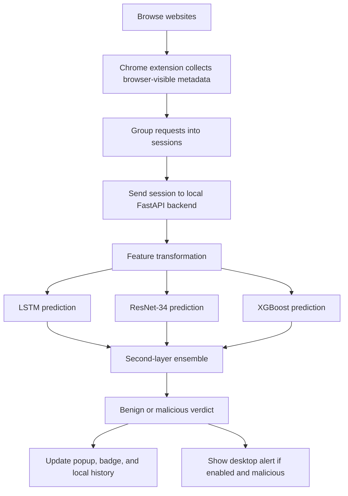

# Traffic Guardian 🛡️

**Real-time detection of potentially malicious encrypted browser traffic using a Chrome extension and a local machine-learning backend.**

Traffic Guardian is a research prototype that monitors browser-visible connection metadata, groups requests into sessions, and analyzes those sessions with a machine-learning ensemble. The extension provides a compact dashboard for monitoring status, reviewing verdicts, managing alerts, and exporting history.

> **Important:** Traffic Guardian is a research tool, not a replacement for your browser's built-in security features or a professional endpoint-protection product. A detection is a model prediction, not proof that a website is malicious. False positives and false negatives are possible.

## Contents

- [Highlights](#highlights)
- [How it works](#how-it-works)
- [Prerequisites](#prerequisites)
- [Project layout](#project-layout)
- [Installation](#installation)
- [Start the backend](#start-the-backend)
- [Install the browser extension](#install-the-browser-extension)
- [Using Traffic Guardian](#using-traffic-guardian)
- [API health check](#api-health-check)
- [Privacy and limitations](#privacy-and-limitations)
- [Troubleshooting](#troubleshooting)
- [Research and implementation notes](#research-and-implementation-notes)

## Highlights

- **Background monitoring:** Collects browser-visible request metadata and resource timing information while you browse.
- **Ensemble prediction:** Uses LSTM, ResNet-34, and XGBoost as first-layer classifiers, with a second-layer ensemble for the final verdict.
- **Clear status indicators:** Shows backend connectivity and safe, monitoring, or threat states in the extension popup.
- **Threat details:** Can display confidence information from the individual model branches.
- **Notifications:** Supports desktop alerts for malicious verdicts when notifications are enabled.
- **History and export:** Keeps a local history of verdicts and supports exporting records to CSV.
- **Adjustable sensitivity:** Provides a threshold control for changing the malicious-classification boundary.
- **Local inference:** The extension sends analysis requests to the backend on your own computer at `127.0.0.1:8642`.
- **Offline handling:** Indicates when the backend is unavailable and is designed to queue and retry pending sessions.

## How it works



The extension gathers available browser metadata and timing information, groups requests by browser tab and domain, and submits a session when the configured batching or idle condition is met. The backend transforms the session into the inputs required by the three model branches and returns a final verdict with confidence information.

## Prerequisites

- Windows 10 or Windows 11 (the supplied launcher is a Windows `.bat` file).
- Google Chrome or a compatible Chromium-based browser.
- Git, or the ability to download the repository as a ZIP file.
- Python installed in a version compatible with the packages pinned in `backend/requirements.txt`.
- The trained model files and preprocessing artifacts required by the backend.

**Python note:** Machine-learning libraries can have specific Python-version requirements. Check `backend/requirements.txt` and use a compatible Python version rather than automatically choosing the newest release. The commands below use Python 3.10 as an example; replace `3.10` with the compatible version installed on your computer if necessary.

## Project layout

The launcher assumes the virtual environment is in the project root and `app.py` is in the same directory as `start_backend.bat`. A typical layout is:

```text
TrafficGuardian/
├── .venv/                         # Python virtual environment (create locally)
├── backend/
│   ├── app.py                     # FastAPI app; exposes app:app
│   ├── inference.py
│   ├── feature_transform.py
│   ├── requirements.txt
│   └── start_backend.bat
├── extension/
│   ├── manifest.json
│   ├── background.js
│   ├── content.js
│   ├── popup/
│   └── utils/
├── models/
│   ├── lstm_model.h5
│   ├── resnet34.pt
│   ├── xgb_model.pkl
│   └── rf_layer2.pkl
├── scalers/
│   ├── scaler_lstm.pkl
│   ├── scaler_resnet_mms.pkl
│   └── selector_resnet.pkl
└── tensors/                        # Used by preprocessing/training workflows
```

This is an illustrative layout based on the SRS. Follow the actual paths configured in your backend if your repository differs. The inference backend also requires `xgb_col_medians.npy`; keep it at the path expected by the backend code. The trained models and scaler/selector files must be present before inference can work.

## Installation

### 1. Get the project

Clone the repository (replace the placeholders with your GitHub repository URL):

```powershell
git clone https://github.com/<YOUR-USERNAME>/<YOUR-REPOSITORY>.git
cd <YOUR-REPOSITORY>
```

Alternatively, download the repository as a ZIP from GitHub, extract it, and open the extracted project folder in PowerShell or File Explorer.

### 2. Create the virtual environment

Run these commands from the **project root** — the folder that contains `backend`:

```powershell
py -3.10 -m venv .venv
.\.venv\Scripts\python.exe -m pip install --upgrade pip
.\.venv\Scripts\python.exe -m pip install -r .\backend\requirements.txt
```

If you already have a working `.venv` and all required packages installed, you can skip this step. If `py -3.10` is not available, install a compatible Python version or adjust the command to match your installation.

### 3. Check the model artifacts

Before starting the backend, confirm that the required model and preprocessing files exist in the locations expected by the code. The SRS lists these core artifacts:

| File | Purpose |
|---|---|
| `models/lstm_model.h5` | LSTM branch model |
| `models/resnet34.pt` | ResNet-34 branch model |
| `models/xgb_model.pkl` | XGBoost branch model |
| `models/rf_layer2.pkl` | Random Forest second-layer ensemble |
| `scalers/scaler_lstm.pkl` | LSTM feature scaler |
| `scalers/scaler_resnet_mms.pkl` | ResNet feature scaler |
| `scalers/selector_resnet.pkl` | ResNet feature selector |
| `xgb_col_medians.npy` | Training-set medians used for missing XGBoost features |

The backend may stop during startup if a required artifact is missing or incompatible. Large model files may not be included in a public Git repository; if they are absent, obtain the intended files from the project maintainer and place them at the locations expected by the code. **Do not substitute unrelated model files.**

## Start the backend

### Recommended: use the batch file

Double-click `backend/start_backend.bat` in File Explorer. The script changes its working directory to the folder containing the batch file and uses the virtual environment one level above it.

The launcher should contain:

```bat
@echo off
title Traffic Guardian Backend
echo ============================================
echo   Traffic Guardian - Inference Backend
echo ============================================
echo.
cd /d "%~dp0"
echo Starting server on http://127.0.0.1:8642 ...
echo Press Ctrl+C to stop.
echo.
..\.venv\Scripts\python.exe -m uvicorn app:app --host 127.0.0.1 --port 8642
pause
```

Keep `.venv` in the repository root and `app.py` beside `start_backend.bat` for this exact script to work. The command `uvicorn app:app` expects an `app.py` file in the current directory and a FastAPI application variable named `app`.

Leave the terminal window open while using Traffic Guardian. To stop the backend, focus that window and press **Ctrl+C**.

### Confirm that it started

Open this URL in your browser:

```text
http://127.0.0.1:8642/health
```

The health endpoint should return a status indicating whether the service is running and the models are loaded. A successful health response means the API is reachable; it does not by itself guarantee that every model can classify every possible session correctly.

## Install the browser extension

1. Open Chrome and navigate to `chrome://extensions`.
2. Turn on **Developer mode**.
3. Click **Load unpacked**.
4. Select the project's **`extension` folder** — the folder containing `manifest.json`, not the repository root.
5. Pin Traffic Guardian to the browser toolbar using the puzzle-piece extensions menu.
6. Ensure the backend is running, then click the Traffic Guardian icon to open the popup.

If you make changes to the extension's source files, return to `chrome://extensions` and click the extension's **Reload** control before testing again.

## Using Traffic Guardian

### 1. Start the backend

Run `backend/start_backend.bat` and confirm that the `/health` endpoint is available. The extension needs the local backend to return model predictions.

### 2. Browse normally

Visit websites as you usually would. Traffic Guardian collects browser-visible request metadata in the background. You do not have to manually submit a query for every request. Sessions are sent for inference when the extension's configured packet-batching or idle-flush condition is met, so a verdict may not appear immediately after opening a page.

### 3. Open the popup dashboard

Click the pinned **Traffic Guardian** toolbar icon. Use the dashboard to review:

- **Connection indicator:** Green means the backend is reachable; red means it is offline or unavailable.
- **Shield/status indicator:** Shows the current monitoring state and changes to a threat state when a malicious verdict is returned.
- **Active domains:** Lists monitored domains and their current state, such as safe, threat, or monitoring.
- **Threat details:** Expand a detection card, where supported, to inspect the final confidence and LSTM, ResNet, and XGBoost branch probabilities.

### 4. Review alerts

When the model returns a malicious verdict, the extension updates its visual status and can display a desktop notification. Notifications depend on browser notification permissions and the setting in the extension. Treat alerts as signals to investigate rather than conclusive proof of malicious activity.

### 5. View previous results

Open the **History** tab to see recent verdicts with details such as the domain, timestamp, verdict, and confidence. The SRS defines a popup timeline for recent entries and local storage capped at 200 history records; older records may be removed as the cap is reached.

### 6. Export a CSV file

In the History tab, click **Export CSV**. If implemented and enabled in your build, the browser downloads a CSV containing stored detection information such as timestamp, domain, verdict, confidence, branch probabilities, and packet count. You can open the CSV with a spreadsheet program for offline review.

### 7. Adjust settings

Open the **Settings** tab to use the controls available in your build:

- **Sensitivity threshold:** Adjusts the classification boundary between benign and malicious. A lower threshold generally flags more sessions and may increase false alarms; a higher threshold generally reduces alerts but can miss more threats.
- **Notifications:** Turn desktop alerts on or off.
- **Backend URL:** The configured local backend address. The default deployment described by this project uses `http://127.0.0.1:8642`.

Settings are intended to be saved locally and applied to subsequent detections. Interface elements can vary if you are running a different version of the extension.

## API health check

| Endpoint | Method | Purpose |
|---|---|---|
| `/health` | `GET` | Reports backend health and model-loading status. |
| `/predict` | `POST` | Internal inference endpoint used by the extension to submit a session and receive a verdict. |

The backend is configured to bind to `127.0.0.1:8642`, which makes it available on the local computer rather than exposing the service directly to the network. Do not change the host to `0.0.0.0` or forward this port to the internet unless you have deliberately designed and secured an appropriate deployment.

## Privacy and limitations

- **No HTTPS decryption:** Traffic Guardian does not decrypt HTTPS/TLS sessions or inspect encrypted page payloads. It relies on metadata and timing information available to the browser extension.
- **Feature proxies:** Some low-level network fields are not exposed to a browser extension. The backend may approximate or impute unavailable model features using the training medians described in the project implementation. This can affect prediction reliability.
- **Local inference:** The intended configuration sends feature/session data to the local backend at `127.0.0.1:8642` rather than to a remote prediction service. Normal website visits still connect to the websites you choose to browse.
- **Predictions are imperfect:** Legitimate traffic may be flagged, and malicious traffic may be missed. Do not rely on this research prototype as your only security control.
- **Performance figures are targets unless measured:** The SRS describes goals for accuracy, F1, false-positive rate, and latency. Do not treat those targets as achieved results unless your own evaluation output confirms them on a documented test set.
- **History is local browser data:** Detection history is stored in Chrome local extension storage. Consider this when sharing a browser profile or exporting a CSV.

## Troubleshooting

### The popup shows a red/offline connection indicator

1. Confirm that the backend terminal is still open and has not reported an error.
2. Open `http://127.0.0.1:8642/health` in the same computer's browser.
3. Check that the backend is using port `8642` and that no other process is occupying it.
4. Reopen the popup after the health endpoint responds.

### `..\.venv\Scripts\python.exe` cannot be found

The batch file expects `.venv` to be in the project root, one folder above `backend/start_backend.bat`. Create the environment from the project root using the installation steps above. Do not move the batch file unless you also update its paths.

### `No module named uvicorn` or another dependency is missing

Activate or use the project's `.venv`, then install the dependencies:

```powershell
.\.venv\Scripts\python.exe -m pip install -r .\backend\requirements.txt
```

### `Could not import module "app"`

Check that `app.py` is in the same folder as `start_backend.bat`, that the file defines `app`, and that the script changes into that folder before executing Uvicorn. If your layout is different, update the launcher to match it.

### The backend starts but reports missing model/scaler files

Verify the trained models, scalers, selector, and `xgb_col_medians.npy` exist at the exact paths expected by `backend/inference.py` and `backend/feature_transform.py`. The source code's paths are authoritative if they differ from the example tree in this README.

### No detection appears immediately

The extension analyzes grouped sessions rather than producing a verdict for every single request. Browse for long enough to satisfy the batching/idle-flush condition, confirm the backend is online, and inspect the terminal for inference errors. Very small sessions may be rejected by the API because the minimum packet requirement has not been met.

### Chrome does not show the extension

In `chrome://extensions`, confirm Developer mode is enabled and that you loaded the folder containing `manifest.json`. Check for errors on the extension's card, then reload it.

## Research and implementation notes

Traffic Guardian is designed around a two-layer ensemble:

1. **Layer 1:** LSTM processes sequential features, ResNet-34 processes a feature-derived matrix representation, and XGBoost processes tabular session features.
2. **Layer 2:** The branch probability outputs are combined by a second-stage Random Forest or an average ensemble, depending on the configured/evaluated implementation.

The intended workflow includes preprocessing, aligned session ordering across branches, training-only scaler fitting, model evaluation, and inference through the local FastAPI service. Keep preprocessing, model artifacts, and inference code consistent: artifacts trained with a different feature order or preprocessing pipeline may produce invalid predictions.

## Contributing

Issues and improvements are welcome. When submitting a change, include the steps to reproduce it and the relevant logs or evaluation results. Avoid committing private browsing data, exported threat histories, API secrets, virtual environments, or large model artifacts unless the repository is specifically intended to distribute them.

## License

Add the project's chosen `LICENSE` file before distributing or reusing the code publicly. No specific license is assumed by this README.
