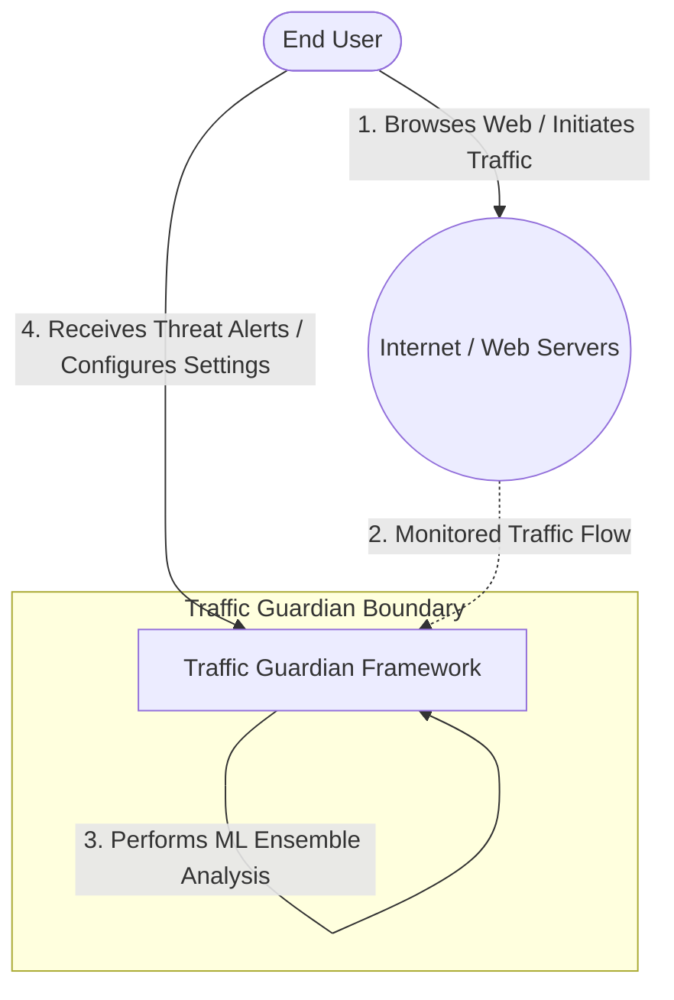
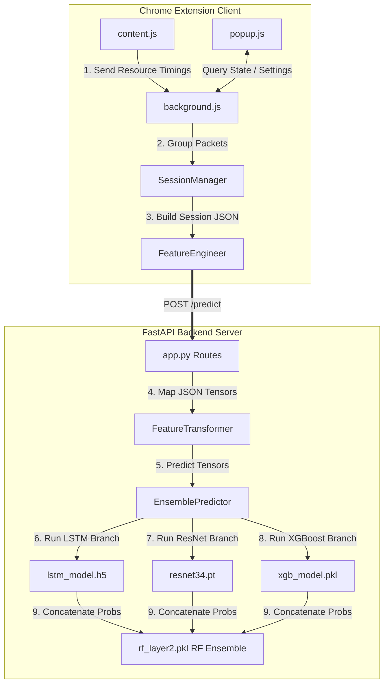
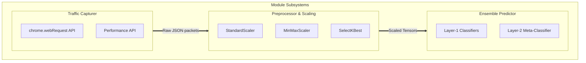

# Software Requirements Specification

## Feature Mining for Encrypted Malicious Traffic Detection
### Traffic Guardian — Chrome Extension + Local ML Backend

---

| Field | Value |
|-------|-------|
| **Document ID** | TG-SRS-2026-001 |
| **Version** | 1.0 |
| **Date** | 2026-07-28 |
| **Status** | Approved for Implementation |
| **Paper Reference** | Wang & Thing (2023) — arXiv:2304.03691 |
| **Dataset** | Mendeley Data — doi:10.17632/xw7r4tt54g.1 |
| **Institution** | IIT, University of Dhaka |

---

## Table of Contents

1. [List of Stakeholders](#1-list-of-stakeholders)
2. [Stakeholder Viewpoints](#2-stakeholder-viewpoints)
3. [Kano Model — Requirements Classification](#3-kano-model--requirements-classification)
4. [User Stories](#4-user-stories)
5. [Actors](#5-actors)
6. [Use Case Diagrams](#6-use-case-diagrams)
7. [Activity Diagrams](#7-activity-diagrams)
8. [Swimlane Diagrams](#8-swimlane-diagrams)
9. [Data-Based Modelling](#9-data-based-modelling)
10. [Class-Based Modelling](#10-class-based-modelling)
11. [Behavioral Modelling](#11-behavioral-modelling)
12. [Functional Requirements](#12-functional-requirements)
13. [Non-Functional Requirements](#13-non-functional-requirements)
14. [Architectural Design](#14-architectural-design)
15. [UML Diagrams](#15-uml-diagrams)
16. [Data Flow Diagrams](#16-data-flow-diagrams)
17. [Dataset Specification](#17-dataset-specification)
18. [API Contract](#18-api-contract)
19. [Performance Targets](#19-performance-targets)
20. [File Inventory](#20-file-inventory)
21. [Key Constraints and Pitfalls](#21-key-constraints-and-pitfalls)
22. [Preliminary Test Plan](#22-preliminary-test-plan)

---

## 1. List of Stakeholders

| # | Stakeholder | Role | Primary Concern |
|---|------------|------|-----------------|
| 1 | **End User (Browser User)** | Installs and uses the Chrome extension during normal browsing | Real-time threat alerts, minimal false positives, unobtrusive experience |
| 2 | **Security Analyst** | Reviews threat history, inspects model decisions, tunes thresholds | Detailed branch-level confidence, CSV export, SHAP explainability |
| 3 | **ML Engineer / Researcher** | Trains, evaluates, and improves models; reproduces paper results | Reproducible pipeline, ablation studies, paper-matching metrics |
| 4 | **System Administrator** | Deploys and maintains the local backend server | One-click launcher, health monitoring, graceful error handling |
| 5 | **Project Supervisor / Academic Advisor** | Evaluates implementation fidelity to Wang & Thing (2023) | Correct two-layer architecture, documented benchmarks, clean codebase |

---

## 2. Stakeholder Viewpoints

After discussion with stakeholders, the following viewpoints of requirements were collected.

### 2.1 End User (Browser User)

- Wants real-time detection of malicious encrypted traffic while browsing without any manual steps
- Expects minimal false alarms — FPR ≤ 0.11% so legitimate browsing is not disrupted
- Wants unobtrusive background monitoring with a clear, immediate threat alert (shield icon + notification)
- Needs one-click backend start requiring no command-line knowledge
- Expects the extension to work immediately after installing without a configuration wizard

### 2.2 Security Analyst

- Wants detailed branch-level confidence breakdown showing the LSTM, ResNet, and XGBoost probability independently
- Needs a scrollable threat history with timestamps, domains, confidence scores, and branch breakdown
- Wants to export all threat history as a CSV file for offline analysis and reporting
- Requires a sensitivity threshold slider to balance detection aggressiveness against false alarm rate
- Requires SHAP-based feature importance visualisation to understand why a session was flagged

### 2.3 ML Engineer / Researcher

- Needs a fully reproducible preprocessing pipeline that produces identical tensors from the same source CSVs
- Wants ablation study capability — each of the three branches (LSTM, ResNet, XGBoost) evaluated standalone before combining in the ensemble
- Expects model performance metrics (Accuracy, F1, Precision, Recall/TPR, FPR, ROC-AUC) to match or exceed the Wang & Thing (2023) paper
- Requires modular code structured so individual branches can be retrained independently without affecting others
- Needs clear documentation of the 93-feature LSTM merge strategy and the session alignment requirement

### 2.4 System Administrator

- Needs a one-click Windows batch script (`start_backend.bat`) to start the server without any CLI interaction
- Wants a `/health` endpoint returning server status and model-loaded flag for uptime monitoring
- Requires the server to bind exclusively to `127.0.0.1:8642` — no external network exposure
- Expects graceful error handling: the extension shows an offline indicator rather than crashing when the backend is unavailable
- Wants all models loaded once at startup — not on each request — to minimise per-request latency

### 2.5 Project Supervisor / Academic Advisor

- Wants faithful reproduction of the Wang & Thing (2023) two-layer ensemble framework: LSTM + ResNet34 + XGBoost → RF/Average Ensemble
- Expects the exact architecture parameters from Figure 1 of the paper: LSTM(128×2), ResNet-34 block counts, XGBoost (lr=0.05, max_depth=10, n_estimators=100), RF (n_estimators=200)
- Needs documented performance benchmarks with Average Ensemble achieving F1 ≥ 99.72% and FPR ≤ 0.11%
- Requires a clean, well-documented codebase with clear separation between preprocessing, training, backend, and extension modules

---

## 3. Kano Model — Requirements Classification

### 3.1 Normal Requirements (Must be present — absence causes dissatisfaction)

1. The system shall classify encrypted network traffic as Benign (0) or Malicious (1)
2. The system shall implement a two-layer ensemble: LSTM + ResNet + XGBoost at Layer 1, RF / Average Ensemble at Layer 2
3. The system shall preprocess raw CSV files into model-ready tensors with correct shapes: `(N,15,93)`, `(N,1,38,38)`, `(N,104)`
4. The system shall expose a REST API at `127.0.0.1:8642` for real-time inference
5. The system shall display detection verdicts in a Chrome extension popup interface
6. The system shall achieve Accuracy ≥ 99.70%, F1 ≥ 99.70%, FPR ≤ 0.15%
7. The system shall compute and report FPR on the benign class specifically: `FP/(FP+TN)` on the label=0 row of the confusion matrix
8. The system shall handle NaN and Inf values by replacing them with column-wise training-set medians

### 3.2 Expected Requirements (Assumed — absence causes complaints)

1. The system shall use **average padding** (per-session per-feature mean), not zero-padding, for LSTM sessions shorter than 15 packets
2. The system shall align all three branches to the same session order using `uid_list` produced by the LSTM groupby step
3. The system shall fit all scalers (StandardScaler, MinMaxScaler) on training data only; val and test sets are transformed only
4. The system shall provide desktop notifications when malicious traffic is detected
5. The extension popup shall show a green/red connection status dot indicating whether the backend is reachable
6. The system shall queue sessions when the backend is offline and retry sending on reconnect
7. The system shall cap threat history at 200 entries in `chrome.storage.local`

### 3.3 Exciting Requirements (Unexpected additions — presence delights users)

1. SHAP TreeExplainer analysis on XGBoost features and Layer-2 RF showing which branch the ensemble trusts most
2. Branch-level confidence bars (LSTM / ResNet / XGBoost) displayed in the popup threat detail card
3. Configurable sensitivity threshold slider allowing users to adjust the malicious classification boundary
4. Animated shield icon with CSS pulse effect on threat detection and breathe effect during scan
5. Glassmorphism dark-mode popup UI with backdrop-filter blur, smooth transitions, and micro-animations
6. One-click CSV export of full threat history for offline analysis
7. Ablation study automation script comparing standalone branch performance vs. full ensemble

---

## 4. User Stories

### 4.1 Data Preprocessing and Loading

| ID | As a... | I want to... | So that... | Priority |
|----|---------|-------------|------------|---------|
| US-1.1 | ML Engineer | load both packet CSV (4.4M rows × 25 cols) and session CSV (488K rows × 280 cols) | I can prepare the training data for all three model branches | Must |
| US-1.2 | ML Engineer | merge both CSVs on `unique_link_mark` to produce 93 LSTM features (7 packet-level + 86 session-level) | the LSTM model receives the complete feature input the paper specifies | Must |
| US-1.3 | ML Engineer | apply average padding to sessions shorter than 15 packets using the per-session per-feature mean | temporal features are not distorted by artificial zeros | Must |
| US-1.4 | ML Engineer | align the session CSV to the LSTM's `uid_list` session ordering before building ResNet and XGBoost tensors | all three branches reference the same session at every row index | Must |
| US-1.5 | ML Engineer | run a single `run_all.py` script that executes the complete preprocessing pipeline in the correct order | I do not have to manually manage step dependencies | Should |

### 4.2 Model Training and Evaluation

| ID | As a... | I want to... | So that... | Priority |
|----|---------|-------------|------------|---------|
| US-2.1 | ML Engineer | train the LSTM, ResNet-34, and XGBoost models independently | I can evaluate each branch's standalone detection performance before combining them | Must |
| US-2.2 | ML Engineer | concatenate the three branch probability outputs `(N,6)` and train a Layer-2 Random Forest | I can improve overall detection performance beyond any single branch | Must |
| US-2.3 | Researcher | run an ablation study comparing all model variants against the paper's reported benchmarks | I can validate that the implementation faithfully reproduces Wang & Thing (2023) | Should |
| US-2.4 | Researcher | run SHAP analysis on XGBoost and the Layer-2 RF | I can explain which features and which branches drive detection decisions | Could |

### 4.3 Real-Time Traffic Analysis

| ID | As a... | I want to... | So that... | Priority |
|----|---------|-------------|------------|---------|
| US-3.1 | End User | have the Chrome extension automatically capture my browsing traffic in the background | malicious connections are detected without any manual action on my part | Must |
| US-3.2 | End User | see a shield icon turn red when a threat is detected | I am immediately and clearly alerted | Must |
| US-3.3 | Security Analyst | inspect which branch (LSTM, ResNet, XGBoost) flagged a session with what probability | I can assess the reliability and reasoning behind a detection | Should |
| US-3.4 | End User | receive a browser notification when malicious traffic is detected | I am alerted even if the extension popup is closed | Should |

### 4.4 Backend Inference

| ID | As a... | I want to... | So that... | Priority |
|----|---------|-------------|------------|---------|
| US-4.1 | System Admin | start the backend with a single double-click on `start_backend.bat` | no command-line knowledge is required to operate the system | Should |
| US-4.2 | System Admin | check a `/health` endpoint that returns the server status and model-loaded flag | I can confirm the system is running correctly at any time | Must |
| US-4.3 | End User | receive a verdict from the backend within 2 seconds of submitting a session | my browsing experience is not noticeably delayed by the analysis | Must |

### 4.5 Threat Management and History

| ID | As a... | I want to... | So that... | Priority |
|----|---------|-------------|------------|---------|
| US-5.1 | Security Analyst | view the last 50 verdicts in a scrollable timeline in the popup | I can identify patterns in malicious traffic across sessions | Should |
| US-5.2 | Security Analyst | export full threat history as a CSV file | I can perform offline analysis and include findings in reports | Could |
| US-5.3 | End User | adjust a sensitivity threshold slider in the extension settings | I can balance between false alarms and missed detections according to my risk tolerance | Should |

### 4.6 Security and Privacy

| ID | As a... | I want to... | So that... | Priority |
|----|---------|-------------|------------|---------|
| US-6.1 | End User | have all traffic analysis processed locally on `127.0.0.1` | my browsing data is never transmitted to any external server | Must |
| US-6.2 | System Admin | have CORS configured to permit only Chrome extension origins | unauthorised clients cannot access the inference API | Must |
| US-6.3 | ML Engineer | ensure Layer-2 is trained only on training-split probabilities | there is no data leakage from the test set into the ensemble | Must |

---

## 5. Actors

### 5.1 Human Actors

| Actor | Type | Description |
|-------|------|-------------|
| End User | Primary | Installs and uses the Chrome extension; receives and acts on threat alerts |
| Security Analyst | Secondary | Inspects threat history, branch confidence, exports logs, tunes sensitivity |
| ML Engineer / Researcher | Secondary | Runs preprocessing, trains models, evaluates results, conducts ablation studies |
| System Administrator | Secondary | Starts and maintains the backend server, monitors health, manages dependencies |

### 5.2 System Actors (Automated Agents)

| Actor | Type | Description |
|-------|------|-------------|
| Chrome Extension | Primary system | Captures traffic, groups sessions, submits to backend, renders verdicts |
| FastAPI Backend | System | Receives session JSON, transforms features, runs inference, returns verdict |
| LSTM Model | Internal | Processes `(1,15,93)` time-series tensor; returns `(1,2)` probabilities |
| ResNet-34 Model | Internal | Processes `(1,1,38,38)` image tensor; returns `(1,2)` probabilities |
| XGBoost Model | Internal | Processes `(1,104)` feature vector; returns `(1,2)` probabilities |
| RF Layer-2 Ensemble | Internal | Processes `(1,6)` concatenated probabilities; returns final verdict |

---

## 6. Use Case Diagrams

### 6.1 Level 0 — Context Diagram

**System boundary**: "Encrypted Malicious Traffic Detection Framework"

**Actors**: End User, ML Engineer, System Admin

```
                    ┌────────────────────────────────────────────────┐
                    │   Encrypted Malicious Traffic Detection System   │
                    │                                                  │
End User ──────────►│  Browse web, view alerts, adjust settings        │
                    │                                                  │
ML Engineer ───────►│  Run preprocessing, train models, evaluate       │
                    │                                                  │
System Admin ──────►│  Start backend, monitor health                   │
                    └────────────────────────────────────────────────┘
```

### 6.2 Level 1 — Major Subsystems

| ID | Use Case | Primary Actors |
|----|----------|----------------|
| UC-1.1 | Data Preprocessing and Feature Engineering | ML Engineer |
| UC-1.2 | LSTM Branch Training and Inference | ML Engineer, Extension |
| UC-1.3 | ResNet Branch Training and Inference | ML Engineer, Extension |
| UC-1.4 | XGBoost Branch Training and Inference | ML Engineer, Extension |
| UC-1.5 | Layer-2 Ensemble Detection | Backend |
| UC-1.6 | Chrome Extension Data Collection and UI | End User, Extension |
| UC-1.7 | Backend API Server | System Admin, Extension |

**Key relationships:**
- "View threat alerts" `<<includes>>` "Run ensemble prediction"
- "Run ensemble prediction" `<<includes>>` "Feature transformation"
- "Train models" `<<extends>>` "Run ablation study"

### 6.3 Level 1.1 — Data Preprocessing (Expanded)

| ID | Use Case | Description |
|----|----------|-------------|
| UC-1.1.1 | Load and Merge CSVs | Read packet (4.4M × 25) and session (488K × 280) CSVs; left-join on `unique_link_mark` → merged (4.4M × 103) |
| UC-1.1.2 | Build LSTM Tensor | `groupby → sort by Time_cost → cutoff 15 → average pad → (N, 15, 93)` |
| UC-1.1.3 | Align Session CSV | Reindex session CSV by `uid_list` from LSTM groupby; verify label alignment |
| UC-1.1.4 | Build ResNet Tensor | `SelectKBest(38) → MinMaxScale → outer product → (N, 1, 38, 38)` |
| UC-1.1.5 | Build XGBoost Features | Extract 72 `_ratio` + 32 ENC time session cols = 104 features → `(N, 104)` |
| UC-1.1.6 | Train/Val Split | Unified stratified 85/15 split producing shared `idx_tr`/`idx_val` for all branches |
| UC-1.1.7 | Fit and Save Scalers | StandardScaler (LSTM) and MinMaxScaler (ResNet), fitted on training data only |

### 6.4 Level 1.1.1 — Load and Merge (Expanded)

| ID | Sub-use case |
|----|-------------|
| UC-1.1.1.1 | Read `packet_based_trainset.csv` (4,435,304 × 25) |
| UC-1.1.1.2 | Read `session_based_trainset.csv` (488,524 × 280) |
| UC-1.1.1.3 | Validate column existence: 7 PKT_TIME_COLS in packet CSV, 86 SESS_TIME_COLS in session CSV |
| UC-1.1.1.4 | Left-join on `unique_link_mark` → merged DataFrame (4,435,304 × 103) |
| UC-1.1.1.5 | Replace `Inf → NaN`; impute NaN with column median |

### 6.5 Level 1.2 — LSTM Branch

| ID | Sub-use case |
|----|-------------|
| UC-1.2.1 | Load LSTM tensor `(N, 15, 93)` from `tensors/X_lstm_train.npy` |
| UC-1.2.2 | Initialise LSTM(128, return_seq=True) → Dropout(0.3) → LSTM(128) → Dropout(0.3) → Dense(256, relu) → Dense(2, softmax) |
| UC-1.2.3 | Train with Adam, sparse_categorical_crossentropy, early stopping patience=5 on val loss |
| UC-1.2.4 | Save model to `models/lstm_model.h5` |
| UC-1.2.5 | Generate and save probability outputs `(N, 2)` for train/val/test splits |

### 6.6 Level 1.3 — ResNet Branch

| ID | Sub-use case |
|----|-------------|
| UC-1.3.1 | Load ResNet tensor `(N, 1, 38, 38)` from `tensors/X_resnet_train.npy` |
| UC-1.3.2 | Initialise ResNet-34: conv1 = 3×3 stride 1 (adapted), maxpool removed, final FC → 2 |
| UC-1.3.3 | Train with Adam optimizer, CrossEntropyLoss, early stopping on val macro-F1 |
| UC-1.3.4 | Save model to `models/resnet34.pt` |
| UC-1.3.5 | Generate and save probability outputs `(N, 2)` for train/val/test splits |

### 6.7 Level 1.4 — XGBoost Branch

| ID | Sub-use case |
|----|-------------|
| UC-1.4.1 | Load XGBoost features `(N, 104)` from `tensors/X_xgb_train.npy` |
| UC-1.4.2 | Initialise XGBClassifier: `binary:logistic`, lr=0.05, n_estimators=100, max_depth=10 |
| UC-1.4.3 | Train with early stopping: patience=10 on eval logloss |
| UC-1.4.4 | Save model to `models/xgb_model.pkl` |
| UC-1.4.5 | Generate and save probability outputs `(N, 2)` for train/val/test splits |

### 6.8 Level 1.5 — Layer-2 Ensemble

| ID | Sub-use case |
|----|-------------|
| UC-1.5.1 | Load all three branch probability arrays for training split |
| UC-1.5.2 | Concatenate horizontally → `(N, 6)` |
| UC-1.5.3 | Train Random Forest: n_estimators=200, max_depth=None, bootstrap=True, max_features='sqrt' |
| UC-1.5.4 | Compute Average Ensemble: `(p_lstm + p_resnet + p_xgb) / 3` (no training required) |
| UC-1.5.5 | Evaluate both methods on test set; select based on detection priority |

### 6.9 Level 1.6 — Chrome Extension

| ID | Sub-use case |
|----|-------------|
| UC-1.6.1 | `content.js`: harvest Resource Timing entries via `performance.getEntriesByType('resource')` every 2 seconds |
| UC-1.6.2 | `background.js`: listen `webRequest.onCompleted` for HTTP metadata (timestamp, IP, status code, response size) |
| UC-1.6.3 | `SessionManager`: group packets by `(tabId, domain)`; flush when ≥15 packets or idle >30 seconds |
| UC-1.6.4 | `FeatureEngineer`: build session JSON payload from grouped packets |
| UC-1.6.5 | `POST /predict` to backend; receive and store verdict |
| UC-1.6.6 | Update popup badge, shield icon, and active domain list |
| UC-1.6.7 | Show browser notification if `verdict === "malicious"` and notifications are enabled |

### 6.10 Level 1.7 — Backend API Server

| ID | Sub-use case |
|----|-------------|
| UC-1.7.1 | Startup: load all 4 models + 3 scalers + `xgb_col_medians.npy` into memory |
| UC-1.7.2 | `POST /predict`: validate → `FeatureTransform` → 3-branch inference → Layer-2 → return verdict JSON |
| UC-1.7.3 | `GET /health`: return `{status: "ok", models_loaded: true, version: "1.0.0"}` |
| UC-1.7.4 | Error handling: HTTP 400 for <3 packets; HTTP 503 if models not loaded; HTTP 500 on inference failure |

---

## 7. Activity Diagrams

### 7.1 Level 1 — System-Wide Activity Flow

```
[Start] → User opens browser
        → Extension content.js begins Resource Timing harvest (every 2s)
        → User browses website
        → webRequest.onCompleted fires for each request
        → background.js adds packet to SessionManager
        → Decision: Session has ≥15 packets OR idle >30s?
          → No: Continue collecting
          → Yes: FeatureEngineer builds session payload
                 → POST /predict to backend
                 → Decision: Backend reachable?
                   → No: Queue session, show offline indicator, retry on reconnect
                   → Yes: Feature transformation
                          → LSTM inference
                          → ResNet inference
                          → XGBoost inference
                          → Layer-2 ensemble
                          → Return verdict JSON
                          → background.js receives verdict
                          → Update badge + popup UI
                          → Decision: Verdict = malicious?
                            → Yes: Show browser notification → Store to history
                            → No: Store to history
[End]
```

### 7.2 Level 1.1 — Preprocessing Pipeline Activity

```
[Start: ML Engineer executes run_all.py]
→ Load packet_based_trainset.csv (4.4M × 25)
→ Load session_based_trainset.csv (488K × 280)
→ Validate all required columns exist
→ Decision: Missing columns?
  → Yes: Raise ColumnError and halt
  → No: Continue
→ Left-join on unique_link_mark → merged DataFrame
→ Replace Inf with NaN; impute NaN with column median
→ Build LSTM tensor:
  → groupby(unique_link_mark, sort=False)
  → For each session:
    → Sort by Time_cost
    → Cut to first 15 packets OR average-pad to 15 packets
    → Append (15,93) matrix + label
  → Stack → X_lstm (N,15,93), y_lstm (N,), uid_list
→ Compute unified train/val split: idx_tr, idx_val (stratified 85/15)
→ Fit StandardScaler on X_lstm[idx_tr]; transform all splits
→ Save LSTM tensors + scaler + uid_list + indices to disk
→ Align session CSV: df_sess.set_index('unique_link_mark').loc[uid_list]
→ Verify alignment: assert labels match y_lstm
→ Build ResNet tensor:
  → SelectKBest(mutual_info_classif, k=38) on 48 payload candidates
  → Fit MinMaxScaler on aligned_sess[idx_tr]; transform all
  → Outer product → (N,38,38) → add channel → (N,1,38,38)
  → Save + selector + scaler
→ Build XGBoost tensor:
  → Extract 72 _ratio + 32 ENC_TIME_SESS_COLS = 104 features
  → Replace Inf/NaN with column medians
  → Save (N,104)
→ Run verification: shape/NaN/alignment checks
→ Decision: All checks pass?
  → No: Log error, identify failing step
  → Yes: Log completion
[End]
```

### 7.3 Level 1.7 — Backend Inference Activity

```
[Start: POST /predict received]
→ Parse JSON body → SessionPayload
→ Validate: packet_count ≥ 3?
  → No: Return HTTP 400 "Insufficient packets"
  → Yes: Continue
→ FeatureTransformer.transform(session_data):
  → Extract Group A packet features (7 per packet)
  → Compute Group B session stats (86 values, broadcast to all 15 rows)
  → Build (15,93) matrix; apply cutoff/padding
  → Apply scaler_lstm → X_lstm (1,15,93)
  → Compute 48 payload candidate stats → apply selector → 38 features
  → Apply scaler_resnet → outer product → X_resnet (1,1,38,38)
  → Compute 104 XGBoost features; impute unavailable with col_medians
  → X_xgb (1,104)
→ LSTM inference: lstm_model.predict(X_lstm) → p_lstm (2,)
→ ResNet inference: softmax(resnet_model(X_resnet_tensor)) → p_resnet (2,)
→ XGBoost inference: xgb_model.predict_proba(X_xgb) → p_xgb (2,)
→ Concatenate: meta = [p_lstm | p_resnet | p_xgb] → (1,6)
→ Layer-2: rf_layer2.predict_proba(meta) → p_final (2,)
→ Apply threshold (default 0.5): verdict = "malicious" if p_final[1] > threshold
→ Build response JSON: verdict + confidence + malicious_prob + branches + inference_ms
→ Return HTTP 200 with verdict JSON
[End]
```

---

## 8. Swimlane Diagrams

### 8.1 SID-1 — System Overview

```
│ End User       │ Chrome Extension         │ FastAPI Backend      │ ML Models           │
│────────────────│──────────────────────────│──────────────────────│─────────────────────│
│ Open browser   │                          │                      │                     │
│ Browse website │→ content.js: harvest     │                      │                     │
│                │  timings every 2s        │                      │                     │
│                │→ background: webRequest  │                      │                     │
│                │→ SessionManager: add pkt │                      │                     │
│                │→ ≥15 pkts: build payload │                      │                     │
│                │→ POST /predict ──────────│→ FeatureTransform    │                     │
│                │                          │→ X_lstm ─────────────│→ LSTM → p_lstm      │
│                │                          │→ X_resnet ───────────│→ ResNet → p_resnet  │
│                │                          │→ X_xgb ──────────────│→ XGBoost → p_xgb   │
│                │                          │→ concat(N,6) ────────│→ RF L2 → verdict    │
│                │←─────────────────────────│← verdict JSON        │                     │
│                │→ update badge/popup      │                      │                     │
│ See alert ←────│← notification (if threat)│                      │                     │
```

### 8.2 SID-1.1 — Preprocessing Pipeline

```
│ ML Engineer    │ LSTM Pipeline          │ ResNet Pipeline        │ XGBoost Pipeline    │ Disk                   │
│────────────────│────────────────────────│────────────────────────│─────────────────────│────────────────────────│
│ run_all.py     │                        │                        │                     │                        │
│ ───────────────│→ Load + merge CSVs     │                        │                     │                        │
│                │→ groupby → cutoff/pad  │                        │                     │                        │
│                │→ (N,15,93) + uid_list  │                        │                     │                        │
│                │→ train/val split       │                        │                     │                        │
│                │→ fit StandardScaler    │                        │                     │                        │
│                │────────────────────────│→ align sess CSV        │                     │                        │
│                │                        │→ SelectKBest(38)       │                     │                        │
│                │                        │→ fit MinMaxScaler      │                     │                        │
│                │                        │→ outer product (38,38) │                     │                        │
│                │                        │────────────────────────│→ 72+32=104 cols      │                        │
│                │                        │                        │→ clean NaN/Inf      │                        │
│                │                        │                        │                     │← save tensors/*.npy    │
│                │                        │                        │                     │← save scalers/*.pkl    │
│                │                        │                        │                     │← save uid_list.npy     │
│ verify ────────│→ shapes + labels + NaN checks                                         │← verification log      │
```

### 8.3 SID-1.7 — Backend Inference

```
│ API Router      │ Feature Transformer    │ LSTM          │ ResNet        │ XGBoost       │ RF Ensemble   │
│─────────────────│────────────────────────│───────────────│───────────────│───────────────│───────────────│
│ POST /predict   │                        │               │               │               │               │
│ validate ≥3pkts │                        │               │               │               │               │
│ ────────────────│→ extract Group A (7)   │               │               │               │               │
│                 │→ compute Group B (86)  │               │               │               │               │
│                 │→ build (15,93) + scale │               │               │               │               │
│                 │→ X_lstm (1,15,93)──────│→ predict      │               │               │               │
│                 │                        │→ p_lstm(2,) ──│──────────────►│               │               │
│                 │→ payload stats + sel.  │               │               │               │               │
│                 │→ outer product + norm  │               │               │               │               │
│                 │→ X_resnet(1,1,38,38)───│───────────────│→ predict      │               │               │
│                 │                        │               │→ p_resnet(2,)─│──────────────►│               │
│                 │→ 104 features + impute  │               │               │               │               │
│                 │→ X_xgb(1,104)───────────│───────────────│───────────────│→ predict_proba│               │
│                 │                        │               │               │→ p_xgb(2,) ───│──────────────►│
│                 │                        │               │               │               │→ hstack (1,6) │
│                 │                        │               │               │               │→ predict_proba│
│                 │                        │               │               │               │→ verdict      │
│ ←───────────────│────────────────────────│───────────────│───────────────│───────────────│← JSON resp.   │
│ return 200      │                        │               │               │               │               │
```

---

## 9. Data-Based Modelling

### 9.1 Noun Identification

**From requirements:**
User, Session, Packet, Domain, Verdict, Branch, Probability, Model, Tensor, Feature, Scaler, Label, Threshold, Notification, History Entry, Settings, CSV File, Extension, Backend, Confidence, Malware Family, Dataset, UID List, Index, Median, Prediction, Error, Health Status

**Final data objects (retained after filtering):**
Session, Packet, Prediction, Model, Tensor, Scaler, Feature Column, Threshold Setting, History Entry, Health Status, Dataset

### 9.2 Entity Relationships

```
Session (1) ──contains──► (N) Packet
Session (1) ──produces──► (1) Prediction
Prediction (1) ──uses──► (3) Model  [LSTM, ResNet, XGBoost]
Prediction (1) ──uses──► (1) Model  [RF Layer-2]
Model (1) ──requires──► (1) Tensor
Model (1) ──requires──► (0..1) Scaler
Tensor (1) ──built from──► (N) Feature Column
Prediction (1) ──stored as──► (1) History Entry
Dataset (1) ──contains──► (N) Session
```

### 9.3 ER Diagram

**Entities and attributes:**

| Entity | Attributes |
|--------|-----------|
| Session | session_id (PK), domain, packet_count, created_at, label |
| Packet | packet_id (PK), session_id (FK), timestamp, duration, requestSize, responseSize, transferSize, encodedBodySize, decodedBodySize, headerSize, protocol, statusCode |
| Prediction | prediction_id (PK), session_id (FK), verdict, confidence, malicious_prob, lstm_prob, resnet_prob, xgboost_prob, created_at, inference_ms |
| HistoryEntry | entry_id (PK), domain, verdict, confidence, timestamp, branches_json |
| Model | model_id (PK), model_type, file_path, file_size_mb, loaded_status |
| Tensor | tensor_id (PK), branch, shape, scaler_path, file_path |
| Settings | key (PK), value, default_value |

**Cardinalities:**

```
Session ─── (1:N) ─── Packet
Session ─── (1:1) ─── Prediction
Prediction ─── (N:M) ─── Model   (through branching)
Model ─── (1:1) ─── Tensor
Tensor ─── (1:0..1) ─── Scaler
Prediction ─── (1:1) ─── HistoryEntry
```

### 9.4 Schema Diagram

```sql
sessions(
    session_id   VARCHAR(255) PRIMARY KEY,
    domain       VARCHAR(255) NOT NULL,
    packet_count INTEGER,
    created_at   BIGINT
)

packets(
    packet_id        SERIAL PRIMARY KEY,
    session_id       VARCHAR(255) REFERENCES sessions(session_id),
    timestamp        BIGINT,
    duration         FLOAT,
    requestSize      INTEGER,
    responseSize     INTEGER,
    transferSize     INTEGER,
    encodedBodySize  INTEGER,
    decodedBodySize  INTEGER,
    headerSize       INTEGER,
    protocol         VARCHAR(20),
    statusCode       INTEGER
)

predictions(
    prediction_id  SERIAL PRIMARY KEY,
    session_id     VARCHAR(255) REFERENCES sessions(session_id),
    verdict        VARCHAR(20)  NOT NULL,
    confidence     FLOAT,
    malicious_prob FLOAT,
    lstm_prob      FLOAT,
    resnet_prob    FLOAT,
    xgboost_prob   FLOAT,
    inference_ms   INTEGER,
    created_at     BIGINT
)

history_entries(
    entry_id    SERIAL PRIMARY KEY,
    domain      VARCHAR(255),
    verdict     VARCHAR(20),
    confidence  FLOAT,
    timestamp   BIGINT
)

models(
    model_id      SERIAL PRIMARY KEY,
    model_type    VARCHAR(50),
    file_path     TEXT,
    file_size_mb  FLOAT,
    loaded_status BOOLEAN
)

tensors(
    tensor_id    SERIAL PRIMARY KEY,
    branch       VARCHAR(20),
    shape        TEXT,
    scaler_path  TEXT,
    file_path    TEXT
)

settings(
    key           VARCHAR(100) PRIMARY KEY,
    value         TEXT,
    default_value TEXT
)
```

---

## 10. Class-Based Modelling

### 10.1 Identified Nouns (Classes)

`FeatureTransformer`, `EnsemblePredictor`, `SessionManager`, `FeatureEngineer`, `PacketData`, `SessionPayload`, `PredictionResponse`, `StandardScaler`, `MinMaxScaler`, `SelectKBest`, `LSTMModel`, `ResNet34`, `XGBClassifier`, `RandomForestClassifier`, `FastAPIApp`, `ContentScript`, `BackgroundWorker`, `PopupUI`, `HistoryManager`, `SettingsManager`, `HealthChecker`

### 10.2 Identified Verbs (Methods)

`transform`, `predict`, `addPacket`, `flush`, `buildPayload`, `harvestTimings`, `loadModels`, `checkHealth`, `renderHistory`, `renderActiveSessions`, `exportCSV`, `showNotification`, `updateBadge`, `storeToHistory`, `fitTransform`, `selectKBest`, `cleanNaN`, `mergeCsvs`, `buildTensor`, `alignSessions`, `splitData`, `saveModel`, `loadModel`, `computeMetrics`

### 10.3 General Class Classification

**Entity classes** (data carriers):
`PacketData`, `SessionPayload`, `PredictionResponse`, `HistoryEntry`, `Settings`

**Boundary classes** (system interfaces):
`PopupUI`, `ContentScript`, `FastAPIApp`

**Control classes** (processing logic):
`FeatureTransformer`, `EnsemblePredictor`, `SessionManager`, `FeatureEngineer`, `BackgroundWorker`, `HealthChecker`

### 10.4 Class Diagram

```
┌─────────────────────────────────┐
│ FeatureTransformer              │
├─────────────────────────────────┤
│ - scaler_lstm: StandardScaler   │
│ - scaler_resnet: MinMaxScaler   │
│ - selector_resnet: SelectKBest  │
│ - xgb_medians: ndarray(104,)     │
├─────────────────────────────────┤
│ + transform(session_data:dict)  │
│   → (ndarray, ndarray, ndarray) │
│ + _extract_packet_features()    │
│   → ndarray(15,7)               │
│ + _compute_session_stats()      │
│   → dict(86 values)             │
│ + _build_lstm_input()           │
│   → ndarray(1,15,93)            │
│ + _build_resnet_input()         │
│   → ndarray(1,1,38,38)          │
│ + _build_xgb_input()            │
│   → ndarray(1,104)               │
└─────────────────────────────────┘
              │ uses
┌─────────────────────────────────┐
│ EnsemblePredictor               │
├─────────────────────────────────┤
│ - lstm: keras.Model             │
│ - resnet: torch.nn.Module       │
│ - xgb: XGBClassifier           │
│ - rf: RandomForestClassifier    │
│ - transformer: FeatureTransformer│
│ - threshold: float = 0.5        │
├─────────────────────────────────┤
│ + __init__(model_dir, scalers_dir│
│            tensors_dir)          │
│ + predict(session_data:dict)    │
│   → dict{verdict,confidence,    │
│           malicious_prob,branches}│
│ + _load_resnet(path:str)        │
│   → torch.nn.Module             │
│ + _resnet_predict(X:ndarray)    │
│   → ndarray(2,)                 │
└─────────────────────────────────┘

┌─────────────────────────────────┐
│ FastAPIApp                      │
├─────────────────────────────────┤
│ - predictor: EnsemblePredictor  │
├─────────────────────────────────┤
│ + startup(): load_models()      │
│ + POST /predict(SessionPayload) │
│   → PredictionResponse          │
│ + GET /health()                 │
│   → {status, models_loaded}     │
└─────────────────────────────────┘

┌─────────────────────────────────┐
│ SessionManager  [JavaScript]    │
├─────────────────────────────────┤
│ - sessions: Map<str,Session>    │
│ - IDLE_TIMEOUT: 30000           │
│ - MIN_PACKETS: 15               │
│ - flushCallback: Function       │
├─────────────────────────────────┤
│ + addPacket(tabId, domain, data)│
│ + flush(sessionKey: string)     │
│ + enrichPacket(tabId, domain, e)│
│ + _checkIdle()                  │
│ + _shouldFlush(session) → bool  │
└─────────────────────────────────┘

┌─────────────────────────────────┐
│ PacketData  [Pydantic]          │
├─────────────────────────────────┤
│ + timestamp: float              │
│ + duration: float               │
│ + requestSize: int              │
│ + responseSize: int             │
│ + transferSize: int             │
│ + encodedBodySize: int          │
│ + decodedBodySize: int          │
│ + headerSize: int               │
│ + protocol: str                 │
│ + statusCode: int               │
└─────────────────────────────────┘

┌─────────────────────────────────┐
│ SessionPayload  [Pydantic]      │
├─────────────────────────────────┤
│ + session_id: str               │
│ + domain: str                   │
│ + packet_count: int             │
│ + packets: List[PacketData]     │
└─────────────────────────────────┘

┌─────────────────────────────────┐
│ PredictionResponse  [Pydantic]  │
├─────────────────────────────────┤
│ + verdict: str                  │
│ + confidence: float             │
│ + malicious_prob: float         │
│ + benign_prob: float            │
│ + branches: dict                │
│ + session_id: str               │
│ + domain: str                   │
│ + packet_count: int             │
│ + inference_ms: int             │
└─────────────────────────────────┘
```

### 10.5 CRC Cards

**CRC Card 1: FeatureTransformer**

| Class | FeatureTransformer |
|-------|-------------------|
| **Responsibility** | Maps browser session packet data to three model-ready tensors: LSTM `(1,15,93)`, ResNet `(1,1,38,38)`, XGBoost `(1,104)` |
| **Collaborators** | `StandardScaler`, `MinMaxScaler`, `SelectKBest`, `EnsemblePredictor`, `SessionPayload` |

**CRC Card 2: EnsemblePredictor**

| Class | EnsemblePredictor |
|-------|------------------|
| **Responsibility** | Loads all four models at startup; runs three-branch inference; combines via Layer-2 RF; returns verdict JSON |
| **Collaborators** | `FeatureTransformer`, `LSTMModel`, `ResNet34`, `XGBClassifier`, `RandomForestClassifier` |

**CRC Card 3: SessionManager**

| Class | SessionManager |
|-------|----------------|
| **Responsibility** | Groups incoming browser packets by `(tabId, domain)` into sessions; flushes sessions to backend on ≥15 packets or 30s idle |
| **Collaborators** | `FeatureEngineer`, `BackgroundWorker`, `FastAPIApp` |

**CRC Card 4: FeatureEngineer**

| Class | FeatureEngineer |
|-------|----------------|
| **Responsibility** | Transforms raw grouped packet list into a `SessionPayload` JSON object with chronologically ordered, validated packet data |
| **Collaborators** | `SessionManager`, `PacketData`, `SessionPayload` |

**CRC Card 5: PacketData**

| Class | PacketData |
|-------|-----------|
| **Responsibility** | Holds all metadata for one browser request-response pair; validates field types and provides defaults for optional fields |
| **Collaborators** | `SessionPayload`, `FeatureEngineer` |

**CRC Card 6: SessionPayload**

| Class | SessionPayload |
|-------|---------------|
| **Responsibility** | Validated JSON body for the `/predict` endpoint; contains session ID, domain, packet count, and ordered packet list |
| **Collaborators** | `FastAPIApp`, `FeatureTransformer`, `PacketData` |

**CRC Card 7: PredictionResponse**

| Class | PredictionResponse |
|-------|-------------------|
| **Responsibility** | Validated JSON response from `/predict` endpoint; contains verdict, confidence, per-branch probabilities, and timing |
| **Collaborators** | `FastAPIApp`, `EnsemblePredictor`, `BackgroundWorker` |

**CRC Card 8: FastAPIApp**

| Class | FastAPIApp |
|-------|-----------|
| **Responsibility** | Exposes `/predict` and `/health` HTTP endpoints; loads models at startup via `EnsemblePredictor`; handles CORS for extension |
| **Collaborators** | `EnsemblePredictor`, `SessionPayload`, `PredictionResponse` |

**CRC Card 9: PopupUI**

| Class | PopupUI |
|-------|--------|
| **Responsibility** | Renders the extension dashboard: connection status, shield state, active domains, threat detail, history tab, settings tab |
| **Collaborators** | `BackgroundWorker`, `HistoryManager`, `SettingsManager`, `HealthChecker` |

**CRC Card 10: ContentScript**

| Class | ContentScript |
|-------|--------------|
| **Responsibility** | Harvests `performance.getEntriesByType('resource')` every 2 seconds; sends timing data to background worker via `chrome.runtime.sendMessage` |
| **Collaborators** | `BackgroundWorker`, `SessionManager` |

**CRC Card 11: BackgroundWorker**

| Class | BackgroundWorker |
|-------|-----------------|
| **Responsibility** | Registers `webRequest.onCompleted` listener; merges timing from content script; routes messages between components; handles verdicts |
| **Collaborators** | `SessionManager`, `FeatureEngineer`, `PopupUI`, `HistoryManager`, `FastAPIApp` |

**CRC Card 12: HistoryManager**

| Class | HistoryManager |
|-------|---------------|
| **Responsibility** | Reads and writes threat history to `chrome.storage.local`; enforces 200-entry cap; provides CSV export |
| **Collaborators** | `BackgroundWorker`, `PopupUI` |

**CRC Card 13: SettingsManager**

| Class | SettingsManager |
|-------|----------------|
| **Responsibility** | Reads and writes user settings (backend URL, threshold, notifications toggle) to `chrome.storage.local` |
| **Collaborators** | `PopupUI`, `SessionManager`, `BackgroundWorker` |

**CRC Card 14: HealthChecker**

| Class | HealthChecker |
|-------|--------------|
| **Responsibility** | Polls `GET /health` every 30 seconds; updates connection indicator; sets backend-offline state |
| **Collaborators** | `PopupUI`, `BackgroundWorker`, `SettingsManager` |

**CRC Card 15: LSTMModel**

| Class | LSTMModel |
|-------|----------|
| **Responsibility** | Keras sequential model: LSTM(128)×2 → Dense(256) → Dense(2,softmax); accepts `(batch,15,93)`, returns `(batch,2)` softmax probs |
| **Collaborators** | `EnsemblePredictor`, `FeatureTransformer` |

---

## 11. Behavioral Modelling

### 11.1 Event Table

| Event | Actor | System Response |
|-------|-------|----------------|
| User navigates to website | End User | content.js begins Resource Timing harvest; webRequest listener activates |
| HTTP request completes | Chrome / webRequest | background.js: `addPacket(tabId, domain, metadata)` |
| Resource Timing harvest fires (2s) | content.js | Send `RESOURCE_TIMINGS` message to background.js; enrich packet records |
| Session reaches ≥15 packets | SessionManager | Trigger flush: build payload → POST /predict |
| Session idle >30 seconds (≥5 pkts) | SessionManager (alarm) | Trigger flush same as above |
| POST /predict received | FastAPI Backend | Validate → transform → 3-branch inference → Layer-2 → return verdict |
| Verdict received (benign) | BackgroundWorker | Update badge green; store to history; update popup |
| Verdict received (malicious) | BackgroundWorker | Update badge red; store to history; show notification; update popup |
| User opens popup | End User | `DOMContentLoaded`: check /health; load history; render active sessions |
| History tab clicked | End User | Load `tg_history` from chrome.storage; render timeline |
| Export CSV clicked | Security Analyst | Convert history to CSV blob; trigger download via `<a>` |
| Settings changed | End User | Write to `chrome.storage.local`; propagate threshold to SessionManager |
| Backend started (start_backend.bat) | System Admin | Uvicorn starts; all 4 models loaded; server binds to 127.0.0.1:8642 |
| GET /health polled | HealthChecker | Return `{status:"ok", models_loaded:true}` |
| Model loaded at startup | EnsemblePredictor | Model held in memory; loading time logged |
| Preprocessing executed | ML Engineer | CSVs loaded, merged, tensors built, aligned, saved to disk |
| Training script run | ML Engineer | Model fitted; early stopping applied; probs saved; metrics logged |
| Ablation study run | Researcher | Each branch evaluated standalone; ensemble compared; results tabulated |
| Export requested | Security Analyst | CSV file generated and downloaded |

### 11.2 State Transition Diagrams

**STD-1: Session Lifecycle**
```
[Idle] ──new packet──► [Collecting]
[Collecting] ──<15 pkts──► [Collecting]
[Collecting] ──≥15 pkts──► [Ready]
[Collecting] ──idle 30s, ≥5 pkts──► [Ready]
[Ready] ──POST /predict──► [Analysing]
[Analysing] ──200 response──► [Verdicted]
[Analysing] ──timeout/error──► [Collecting] (retry)
[Verdicted] ──store to history──► [Archived]
```

**STD-2: Backend Server**
```
[Starting] ──uvicorn init──► [Loading Models]
[Loading Models] ──all 4 loaded OK──► [Ready]
[Loading Models] ──file not found──► [Error] ──restart──► [Starting]
[Ready] ──POST /predict received──► [Processing]
[Processing] ──inference complete──► [Ready]
[Processing] ──inference exception──► [Error] ──log + recover──► [Ready]
```

**STD-3: Chrome Extension**
```
[Installed] ──check /health──► [Connecting]
[Connecting] ──200 OK──► [Monitoring]
[Connecting] ──timeout/error──► [Offline] ──retry 30s──► [Connecting]
[Monitoring] ──malicious verdict──► [Threat Alert]
[Threat Alert] ──notification shown──► [Monitoring]
[Monitoring] ──backend goes offline──► [Offline]
[Offline] ──/health succeeds──► [Monitoring]
```

**STD-4–6: Model Training (LSTM / ResNet / XGBoost)**
```
[Init] ──load tensor──► [Loading Data]
[Loading Data] ──tensor OK──► [Training]
[Training] ──epoch N──► [Validating]
[Validating] ──no improvement < patience──► [Training]
[Validating] ──early stop triggered──► [Saving]
[Saving] ──model + probs saved──► [Done]
```

**STD-7: Layer-2 Ensemble**
```
[Init] ──load 3 prob arrays──► [Loading Probs]
[Loading Probs] ──hstack (N,6)──► [Training RF]
[Training RF] ──RF fitted──► [Eval Average]
[Eval Average] ──avg ensemble computed──► [Comparing]
[Comparing] ──select method by priority──► [Done]
```

**STD-8: Preprocessing Pipeline**
```
[Init] ──run_all.py──► [Loading CSVs]
[Loading CSVs] ──validation OK──► [Merging]
[Merging] ──left join done──► [LSTM Build]
[LSTM Build] ──tensor saved + uid_list──► [Align]
[Align] ──session CSV reindexed──► [ResNet Build]
[ResNet Build] ──images saved──► [XGB Build]
[XGB Build] ──97-col array saved──► [Verify]
[Verify] ──all checks pass──► [Done]
[Verify] ──check failed──► [Error] ──log + halt──► [Init]
```

**STD-9: Prediction Request**
```
[Received] ──parse JSON──► [Validating]
[Validating] ──<3 pkts──► [400 Error]
[Validating] ──valid──► [Transforming]
[Transforming] ──X_lstm,X_resnet,X_xgb ready──► [LSTM Infer]
[LSTM Infer] ──p_lstm(2,)──► [ResNet Infer]
[ResNet Infer] ──p_resnet(2,)──► [XGB Infer]
[XGB Infer] ──p_xgb(2,)──► [Ensemble]
[Ensemble] ──RF predict (1,6)──► [Response]
[Response] ──200 JSON sent──► [Done]
```

**STD-10: Popup UI**
```
[Closed] ──user clicks icon──► [Opening]
[Opening] ──DOM loaded──► [Checking Health]
[Checking Health] ──200 OK──► [Loading History]
[Checking Health] ──error──► [Offline State]
[Loading History] ──history rendered──► [Live Monitoring]
[Live Monitoring] ──VERDICT_UPDATE message──► [Live Monitoring]
[Live Monitoring] ──user closes popup──► [Closed]
```

**STD-11: Packet Data**
```
[Captured] ──webRequest or content.js──► [Enriched]
[Enriched] ──both sources merged──► [Grouped]
[Grouped] ──added to SessionManager──► [Flushed when session ready]
[Flushed] ──sent to backend──► [Processed]
```

**STD-12: Threat Notification**
```
[Triggered] ──malicious verdict + notifications_enabled──► [Displayed]
[Displayed] ──user clicks notification──► [Acknowledged]
[Acknowledged] ──opens popup/history──► [Dismissed]
[Displayed] ──auto-dismiss timeout──► [Dismissed]
```

**STD-13: Model File**
```
[Untrained] ──training script runs──► [Training]
[Training] ──early stop / completion──► [Saved]
[Saved] ──backend startup──► [Loaded]
[Loaded] ──EnsemblePredictor active──► [Serving]
[Serving] ──backend shutdown──► [Saved]
```

### 11.3 Sequence Diagrams

**SD-1: Real-Time Traffic Detection**
```
End User → Browser          : Navigate to website
Browser → content.js        : Page loads resources
content.js → Background.js  : RESOURCE_TIMINGS message (every 2s)
Background.js → SessionManager : addPacket(tabId, domain, data)
SessionManager → SessionManager : Check packets ≥ 15
SessionManager → FeatureEngineer : buildSessionPayload(session)
FeatureEngineer → Backend /predict : POST session JSON
Backend → FeatureTransformer : transform(session_data)
FeatureTransformer → LSTM Model : predict(X_lstm) → probs(1,2)
FeatureTransformer → ResNet Model : predict(X_resnet) → probs(1,2)
FeatureTransformer → XGBoost Model : predict(X_xgb) → probs(1,2)
Backend → RF Layer-2 : predict(concat_probs) → final verdict
Backend → Extension : {verdict, confidence, branches}
Background.js → Popup : Update UI (badge, shield, domain list)
Background.js → User : Desktop notification (if malicious)
```

**SD-2: Preprocessing Pipeline**
```
ML Engineer → run_all.py       : Execute
run_all.py → LSTM Pipeline     : merge CSVs → groupby → cutoff → pad → (N,15,93) + uid_list
run_all.py → Alignment         : reindex session CSV by uid_list
run_all.py → ResNet Pipeline   : SelectKBest(38) → MinMaxScale → outer_product → (N,1,38,38)
run_all.py → XGBoost Pipeline  : 72 ratio + 32 ENC = 104 cols → (N,104)
run_all.py → Disk              : save tensors, scalers, indices, uid_list
run_all.py → verification.py   : shape + NaN + alignment checks
```

**SD-3: Model Training Flow**
```
ML Engineer → train_lstm.py    : fit LSTM(128×2) → save lstm_model.h5 + probs
ML Engineer → train_resnet.py  : fit ResNet34 → save resnet34.pt + probs
ML Engineer → train_xgboost.py : fit XGBClassifier → save xgb_model.pkl + probs
ML Engineer → train_layer2.py  : concat probs(N,6) → fit RF → save rf_layer2.pkl
ML Engineer → metrics.py       : evaluate all models → report F1, FPR, TPR, AUC
```

**SD-4: Threat History Export**
```
Security Analyst → Popup     : Click "Export CSV"
Popup → chrome.storage.local : getItem("tg_history")
chrome.storage → Popup       : return history array (≤200 entries)
Popup → Popup                : convert to CSV string
Popup → Browser              : create Blob + download <a> element
Browser → Security Analyst   : file download dialog
```

**SD-5: Backend Health Check**
```
HealthChecker → Backend /health : GET request every 30s
Backend → HealthChecker         : {status:"ok", models_loaded:true}
HealthChecker → PopupUI         : update connection dot (green)
--- On failure ---
HealthChecker → Backend /health : GET request (timeout or connection refused)
HealthChecker → PopupUI         : update connection dot (red) + show offline banner
```

**SD-6: Settings Change**
```
End User → Popup             : Adjust sensitivity threshold slider
Popup → chrome.storage.local : setItem("tg_settings", updated_settings)
Popup → BackgroundWorker     : sendMessage({type:"SETTINGS_UPDATE", settings})
BackgroundWorker → SessionManager : update threshold + minPackets
```

---

## 12. Functional Requirements

### FR-1: Data Preprocessing Module

| ID | Requirement | Priority |
|----|-------------|----------|
| FR-1.1 | Load packet CSV (4,435,304 rows × 25 cols) and session CSV (488,524 rows × 280 cols) | Must |
| FR-1.2 | Merge packet + session CSVs on `unique_link_mark` (left join) to produce a merged DataFrame carrying 93 time-related LSTM features (7 packet-level + 86 session-level) | Must |
| FR-1.3 | Group merged data by session; sort by `Time_cost` chronologically; apply 15-packet cutoff for long sessions; apply **average padding** (per-session per-feature mean, not zero) for short sessions → output shape `(N, 15, 93)` | Must |
| FR-1.4 | Capture `uid_list` session ordering from the LSTM groupby step; reindex session CSV to this ordering and verify label alignment before building ResNet and XGBoost tensors | Must |
| FR-1.5 | Select top 38 payload columns from 48 candidates using `SelectKBest(mutual_info_classif, k=38)`; fit selector on training split only | Must |
| FR-1.6 | Generate 38×38 grayscale images via outer product `np.einsum('ni,nj->nij', X, X)` → shape `(N, 1, 38, 38)` | Must |
| FR-1.7 | Extract 72 `_ratio` suffix columns + 32 ENC time session columns = 104 XGBoost features → shape `(N, 104)` | Must |
| FR-1.8 | Apply one unified stratified train/val split (85/15, `random_state=42`) producing shared `idx_tr`/`idx_val` applied identically across all three branches | Must |
| FR-1.9 | Fit `StandardScaler` on LSTM training data only; fit `MinMaxScaler` on ResNet training data only; transform validation and test splits separately | Must |
| FR-1.10 | Replace `Inf` values with `NaN`; impute `NaN` with column-wise training-set medians | Must |
| FR-1.11 | Save all tensors (`tensors/*.npy`), scalers (`scalers/*.pkl`), selector, indices (`idx_tr.npy`, `idx_val.npy`), and `uid_list.npy` to disk | Must |

### FR-2: Model Training Module

| ID | Requirement | Priority |
|----|-------------|----------|
| FR-2.1 | Train multi-layer LSTM: `LSTM(128, return_seq=True) → Dropout(0.3) → LSTM(128) → Dropout(0.3) → Dense(256, relu) → Dense(2, softmax)` on input `(N, 15, 93)` | Must |
| FR-2.2 | Train ResNet-34 adapted for 1-channel 38×38 input: conv1 changed to 3×3 stride 1; maxpool removed; final FC layer → 2 outputs | Must |
| FR-2.3 | Train XGBoost: `binary:logistic` objective, learning_rate=0.05, n_estimators=100, max_depth=10 | Must |
| FR-2.4 | Save softmax/sigmoid probability outputs `(N, 2)` from each Layer-1 model for train, val, and test splits | Must |
| FR-2.5 | Train Layer-2 Random Forest on concatenated branch probabilities `(N, 6)` with n_estimators=200, max_depth=None, bootstrap=True, max_features='sqrt' | Must |
| FR-2.6 | Implement Layer-2 Average Ensemble: `p_final = (p_lstm + p_resnet + p_xgb) / 3`; no training required | Must |
| FR-2.7 | Apply early stopping: patience=5 on val loss for LSTM; patience=10 on eval logloss for XGBoost | Should |

### FR-3: Backend Inference Server

| ID | Requirement | Priority |
|----|-------------|----------|
| FR-3.1 | FastAPI server bound to `127.0.0.1:8642` with CORS configured for Chrome extension origins (`chrome-extension://*`) | Must |
| FR-3.2 | `POST /predict` — accept `SessionPayload` JSON; return `PredictionResponse` with verdict, confidence, malicious_prob, and per-branch probabilities | Must |
| FR-3.3 | `GET /health` — return `{status:"ok", models_loaded:true, version:"1.0.0"}` within 50 ms | Must |
| FR-3.4 | `FeatureTransformer.transform()` — map browser packet data to LSTM `(1,15,93)`, ResNet `(1,1,38,38)`, XGBoost `(1,104)` tensors | Must |
| FR-3.5 | `EnsemblePredictor.predict()` — load all 4 models once at startup; run 3 Layer-1 branches sequentially; combine via Layer-2 RF; return verdict JSON | Must |
| FR-3.6 | Fill unavailable TCP/IP features (TTL, TCP window size) with training-set medians from `tensors/xgb_col_medians.npy` | Must |
| FR-3.7 | Reject requests with fewer than 3 packets with HTTP 400 and descriptive error message | Should |
| FR-3.8 | Provide one-click Windows launcher `backend/start_backend.bat` | Should |

### FR-4: Chrome Extension — Data Collection

| ID | Requirement | Priority |
|----|-------------|----------|
| FR-4.1 | Manifest V3 service worker with `webRequest` permission; capture HTTP metadata from `onCompleted` event (timestamp, IP, status code, response headers) | Must |
| FR-4.2 | `content.js` using Resource Timing API: harvest `performance.getEntriesByType('resource')` every 2 seconds; send to background via `chrome.runtime.sendMessage` | Must |
| FR-4.3 | `SessionManager`: group requests by `(tabId, domain)` key; flush to backend when ≥15 packets accumulated or session idle >30 seconds (min 5 packets) | Must |
| FR-4.4 | `feature_engineer.js`: build chronologically ordered, validated session JSON payload from grouped packet records | Must |
| FR-4.5 | Send `POST /predict` to `http://127.0.0.1:8642`; handle 200 verdict, non-200 errors, and network timeout (10s) | Must |

### FR-5: Chrome Extension — User Interface

| ID | Requirement | Priority |
|----|-------------|----------|
| FR-5.1 | Popup dashboard (380px × 520px) with dark-mode glassmorphism design using CSS variables and `backdrop-filter: blur(12px)` | Must |
| FR-5.2 | Connection status indicator: green dot (backend reachable) / red dot (offline) — updated by polling `/health` every 30 seconds | Must |
| FR-5.3 | Shield status icon: animated green during safe monitoring, animated red pulse on threat detection | Must |
| FR-5.4 | Active domains list: scrollable list of current tab's monitored domains with verdict pills (safe / threat / monitoring) | Must |
| FR-5.5 | Threat detail card: expandable card showing per-branch confidence bars for LSTM, ResNet, and XGBoost; radial confidence meter using `conic-gradient` | Should |
| FR-5.6 | History tab: last 50 verdicts displayed as a timeline with domain, verdict pill, timestamp, and confidence score | Should |
| FR-5.7 | Settings tab: backend URL text field, sensitivity threshold slider (0.0–1.0), notifications toggle | Should |
| FR-5.8 | Desktop browser notification when malicious traffic is detected (if notifications enabled): shows domain + confidence percentage + per-branch summary | Should |
| FR-5.9 | Export threat history as CSV with columns: timestamp, domain, verdict, confidence, lstm_prob, resnet_prob, xgboost_prob, packet_count | Could |

### FR-6: Evaluation Module

| ID | Requirement | Priority |
|----|-------------|----------|
| FR-6.1 | Compute and report Accuracy, F1 (macro and weighted), Precision, Recall/TPR, FPR, ROC-AUC for each model and each ensemble method | Must |
| FR-6.2 | Compute FPR as `FP / (FP + TN)` using the benign class (label=0) row of the confusion matrix — not macro-averaged | Must |
| FR-6.3 | Run ablation study: evaluate each of the three Layer-1 branches standalone; compare to both Layer-2 ensemble methods; tabulate results | Should |
| FR-6.4 | Run SHAP TreeExplainer on XGBoost to identify top payload ratio features; run SHAP on Layer-2 RF to identify which branch probabilities are trusted most | Could |

---

## 13. Non-Functional Requirements

| ID | Category | Requirement | Target |
|----|----------|-------------|--------|
| NFR-1 | **Performance** | Model detection performance | Accuracy ≥ 99.70%, F1 ≥ 99.70%, FPR ≤ 0.15%, TPR ≥ 99.50% |
| NFR-2 | **Latency** | Backend end-to-end inference time per session | < 2 seconds on CPU (target ≤ 500 ms) |
| NFR-3 | **Scalability** | Concurrent extension sessions | Handle requests from multiple browser tabs simultaneously; session buffer ≥ 50 concurrent sessions |
| NFR-4 | **Privacy** | Data processing locality | All inference at `127.0.0.1`; no session data transmitted externally; no payload content accessed |
| NFR-5 | **Reliability** | Backend offline handling | Graceful degradation: queue sessions, show offline indicator, auto-retry on reconnect; no extension crash |
| NFR-6 | **Usability** | Installation and startup | One-click backend start via `.bat` file; extension installs via Chrome developer mode; no CLI knowledge required |
| NFR-7 | **Portability** | Runtime environments | Backend: Windows 10/11 with Python 3.8+; Extension: Chrome 120+ / any Chromium-based browser |
| NFR-8 | **Data Integrity** | Cross-branch session alignment | All three branches must reference the same session at every row index — guaranteed by `uid_list` alignment step |
| NFR-9 | **No Test Leakage** | Training discipline | Layer-2 trains exclusively on Layer-1 training-split probabilities; test-split probabilities are used only for final evaluation |
| NFR-10 | **Storage** | Threat history cap | `tg_history` capped at 200 entries in `chrome.storage.local`; oldest entries pruned automatically |

---

## 14. Architectural Design

Architectural design is a visual representation in software engineering that outlines the high-level structure and organization of a software system. It focuses on defining the major components or modules of the system, their interactions, and the overall system's architecture.

### 14.1 Architectural Context Diagram
The Architectural Context Diagram shows the high-level interactions between the user, external environment (browser/internet), and the system boundaries. It references the single actor (User) from the use case diagram and containment from ER modeling.

The architectural context diagram for the tool is given below-


*Fig-7: Architectural Context Diagram*

### 14.2 Archetypes
This segment outlines the key architectural patterns (archetypes) used: Client-Server for overall structure, MVC (Model-View-Controller) for the application logic, and Layered Architecture for separation of concerns.

The archetypes for the tool are defined below-

1. **Client-Server Pattern:** The Chrome Extension acts as a client intercepting local network traffic and requesting prediction verdicts from the local FastAPI backend server.
2. **Model-View-Controller (MVC):** The popup UI acts as the View, background service workers and routes act as Controllers coordinating the state, and the prediction engine + persistence stores act as the Model.
3. **Layered Architecture:** Clear division between presentation components (popup UI), communication brokers (background worker, FastAPI routers), business logic (SessionManager, FeatureTransformer), and execution drivers (PyTorch/TF model executors).

```mermaid
graph TD
    subgraph ArchetypesDiagram [Architectural Archetypes Layering]
        subgraph ViewLayer [View (Presentation)]
            UI[Extension Popup UI / HTML / CSS]
        end
        subgraph ControllerLayer [Controller (Coordination)]
            Worker[background.js Service Worker]
            API_App[FastAPI App / Routes]
        end
        subgraph ModelLayer [Model (Business Logic / ML)]
            Mgr[SessionManager]
            Transformer[FeatureTransformer]
            Inference[EnsemblePredictor]
        end
        UI <-->|Message Passing| Worker
        Worker ==>|HTTP POST /predict| API_App
        Worker -->|Manages| Mgr
        API_App -->|Transform| Transformer
        API_App -->|Inference| Inference
    end
```
*Fig-8: Archetypes*

### 14.3 Top Level Components
The Top Level Components diagram details the main modules and their interactions, similar to the component diagram, referencing class modeling (classes like SessionManager, FeatureTransformer) and ER (file entities as storage).

Overall architectural structure with top-level components is illustrated below-


*Fig-9: Top Level Components*


*Fig-10: Top Level Components(Module)*

### 14.4 Deployment Diagram
To effectively deploy the Traffic Guardian, it's essential to have a clear and straightforward deployment architecture. This ensures scalability, maintainability, and ease of implementation. Below is a simplified deployment diagram partitioned into Browser and Server sections.

The deployment diagram of the Traffic Guardian is shown below:

```mermaid
graph TD
    subgraph BrowserNode [Browser Workspace (Google Chrome 120+)]
        CS_Script[content.js Script]
        SW_Worker[background.js Service Worker]
        Popup_UI[popup.html UI Dashboard]
    end
    subgraph LocalHostNode [Local Host Runtime Environment (Windows PC)]
        Python_Env[Python 3.8+ Runtime]
        FastAPI_App[FastAPI Server via Uvicorn]
        Disk_Storage[Disk Model Files]
    end
    SW_Worker ==>|HTTP localhost:8642 /predict| FastAPI_App
    FastAPI_App -.->|Imports| Python_Env
    FastAPI_App -.->|Loads weights from| Disk_Storage
```
*Fig-11: Deployment Diagram*

---

## 15. UML Diagrams

### 15.1 Component Diagram

```
┌──────────────────────────────────────────────────────────┐
│ <<browser>> Chrome Extension                              │
│  ┌──────────────┐  ┌──────────────────────────────────┐  │
│  │ content.js   │  │ background.js (Service Worker)   │  │
│  │ Resource     │  │  ┌────────────────────────────┐  │  │
│  │ Timing API   │  │  │ SessionManager             │  │  │
│  └──────┬───────┘  │  │ FeatureEngineer            │  │  │
│         │message   │  └────────────────────────────┘  │  │
│         └──────────┤                                   │  │
│                    └───────────────┬──────────────────┘  │
│  ┌──────────────────────────────┐  │ chrome.runtime.msg  │
│  │ popup/                       │  │                      │
│  │   popup.html / popup.js      ├──┘                      │
│  │   popup.css                  │                         │
│  └──────────────────────────────┘                         │
└─────────────────────────────┬────────────────────────────┘
                              │ HTTP POST /predict (localhost:8642)
┌─────────────────────────────▼────────────────────────────┐
│ <<server>> FastAPI Backend (127.0.0.1:8642)               │
│  ┌───────────┐  ┌─────────────────┐  ┌────────────────┐  │
│  │ app.py    │  │ feature_        │  │ inference.py   │  │
│  │ (routes)  │→ │ transform.py    │→ │ EnsemblePred.  │  │
│  └───────────┘  └─────────────────┘  └────────┬───────┘  │
└──────────────────────────────────────────────┼───────────┘
                                               │ loads
┌──────────────────────────────────────────────▼───────────┐
│ models/                                                    │
│  lstm_model.h5  ·  resnet34.pt  ·  xgb_model.pkl  ·  rf_layer2.pkl │
└──────────────────────────────────────────────────────────┘
```

### 15.2 Deployment Diagram

```
<<device>> User's Windows PC
│
├── <<browser>> Google Chrome 120+
│     └── <<extension>> Traffic Guardian (Manifest V3)
│           ├── Service Worker: background.js
│           ├── Content Script: content.js
│           └── Popup UI: popup.html / popup.js / popup.css
│
└── <<server>> Local Python Backend
      ├── <<runtime>> Python 3.8+
      ├── <<framework>> FastAPI + Uvicorn (127.0.0.1:8642)
      ├── <<model>> TensorFlow 2.x — LSTM (lstm_model.h5)
      ├── <<model>> PyTorch 2.x — ResNet-34 (resnet34.pt)
      ├── <<model>> XGBoost — XGBClassifier (xgb_model.pkl)
      └── <<model>> scikit-learn — RF Ensemble (rf_layer2.pkl)
```

---

## 16. Data Flow Diagrams

### 16.1 Level 0 — Context Diagram

```
[User's Browser] → (Network Traffic Metadata) → [System] → (Verdict: Benign/Malicious) → [User]
```

### 16.2 Level 1 — System DFD

```
[Browser] → {Raw HTTP metadata} → [1.0 Data Collection (Extension)]
         → {Session JSON: packets[]} → [2.0 Feature Transform (Backend)]
         → {X_lstm(1,15,93), X_resnet(1,1,38,38), X_xgb(1,104)} → [3.0 Model Inference]
         → {probs(1,2) × 3 branches} → [4.0 Ensemble (Layer-2)]
         → {verdict, confidence, branches} → [5.0 Result Display (Popup)]
         → {Badge/Shield/Notification} → [User]
```

### 16.3 Level 2 — Preprocessing DFD (Offline)

```
[D1: packet_based_trainset.csv (4.4M × 25)]
[D2: session_based_trainset.csv (488K × 280)]
      │
      ▼
[2.1 Merge on unique_link_mark] → merged DataFrame (4.4M × 103)
      │
      ▼
[2.2 LSTM Tensor Builder]
      groupby(unique_link_mark) → sort(Time_cost) → cutoff/avg-pad → (N,15,93)
      → uid_list
      │
      ▼
[2.3 Session Alignment by uid_list] → df_sess_aligned (488K × 280, reordered)
      │
      ▼
[2.4 ResNet: SelectKBest(38) → MinMax → outer_product → (N,1,38,38)]
      │
      ▼
[2.5 XGBoost: 72 ratio + 32 ENC time = 104 cols → (N,104)]
      │
      ▼
[D3: tensors/*.npy] + [D4: scalers/*.pkl] + [D5: uid_list.npy] + [D6: idx_tr/val.npy]
```

---

## 17. Dataset Specification

| Property | Value |
|----------|-------|
| Packet CSV (Train) | 4,435,304 rows × 25 columns |
| Session CSV (Train) | 488,524 rows × 280 columns |
| Packet CSV (Test) | ~900K rows × 25 columns |
| Session CSV (Test) | ~100K rows × 280 columns |
| Session identifier | `unique_link_mark` (shared key across both CSVs) |
| Label column | `label` — 0 = Benign, 1 = Malicious |
| Class balance | ~243,054 benign / ~245,470 malicious (near-balanced) |
| Malicious families | 26 (Ammyy, Cerber Ransomware, Dridex, TrickBot, Ursnif, Zbot, Locky, Miuref, Vawtrak, and others) |
| Benign sources | CIRA-CIC-DoHBRW-2020, CICIDS-2017, CICIDS-2012 |
| Train/Test split | Pre-defined by dataset: use `Train Set/` for training, `Test Set/` for evaluation |

### Feature Distribution Across Branches

| Branch | Feature source | Feature type | Count | Tensor shape |
|--------|---------------|-------------|-------|-------------|
| LSTM | Both CSVs (merged) | 7 per-packet time + 86 session-level time (broadcast) | **93** | `(N, 15, 93)` |
| ResNet | Session CSV (aligned) | Payload length stats, SelectKBest top 38 of 48 | **38** | `(N, 1, 38, 38)` |
| XGBoost | Session CSV (aligned) | 72 `_ratio` cols + 32 ENC time session cols | **104** | `(N, 104)` |
| Layer-2 | Model outputs | Concatenated branch probability pairs | **6** | `(N, 6)` |

---

## 18. API Contract

### POST /predict

**Request body:**
```json
{
  "session_id": "123:example.com",
  "domain": "example.com",
  "packets": [
    {
      "timestamp": 1720300000000,
      "duration": 45.2,
      "requestStart": 12.1,
      "responseEnd": 57.3,
      "requestSize": 512,
      "responseSize": 15360,
      "transferSize": 15872,
      "encodedBodySize": 15200,
      "decodedBodySize": 48000,
      "headerSize": 672,
      "protocol": "h2",
      "statusCode": 200
    }
  ]
}
```

**Response body:**
```json
{
  "verdict": "malicious",
  "confidence": 0.9987,
  "malicious_prob": 0.9987,
  "benign_prob": 0.0013,
  "branches": {
    "lstm": 0.9812,
    "resnet": 0.9541,
    "xgboost": 0.9933
  },
  "session_id": "123:example.com",
  "domain": "example.com",
  "packet_count": 15,
  "inference_ms": 124
}
```

**Error responses:**

| Scenario | HTTP Status | Body |
|----------|------------|------|
| Fewer than 3 packets | 400 | `{"error": "Insufficient packets: minimum 3 required"}` |
| Models not loaded | 503 | `{"error": "Models not initialised"}` |
| Inference failure | 500 | `{"error": "<exception message>"}` |
| Invalid JSON | 422 | Pydantic validation error detail |

### GET /health

**Response:**
```json
{
  "status": "ok",
  "models_loaded": true,
  "version": "1.0.0"
}
```

---

## 19. Performance Targets

| Metric | Average Ensemble (recommended) | RF Ensemble |
|--------|-------------------------------|-------------|
| Accuracy | **99.73%** | 99.65% |
| F1 Score | **99.72%** | 99.65% |
| Precision | **99.89%** | 99.63% |
| Recall/TPR | 99.56% | **99.68%** |
| FPR (benign class) | **0.11%** | 0.32% |
| ROC-AUC | 99.94% | **99.95%** |

> **Selection guide**: Use Average Ensemble as default — it achieves the lowest FPR (0.11%) and highest precision. Switch to RF Ensemble only when maximising TPR/Recall is the priority (missed detections are more costly than false alarms).

> **FPR definition**: `FP / (FP + TN)` computed on the benign class row (label=0) of the confusion matrix. Not macro-averaged across all classes.

---

## 20. File Inventory

### Preprocessing (`src/preprocessing/`)

| File | Purpose |
|------|---------|
| `feature_columns.py` | All column list definitions: `PKT_TIME_COLS` (7), `SESS_TIME_COLS` (86), `PAYLOAD_CANDIDATES` (48), `ENC_TIME_SESS_COLS` (32) |
| `lstm_pipeline.py` | Merge → groupby → cutoff 15 → average-pad → `(N, 15, 93)` + `uid_list` |
| `resnet_pipeline.py` | Align → SelectKBest(38) → MinMaxScale → outer product → `(N, 1, 38, 38)` |
| `xgb_pipeline.py` | Align → 72 ratio + 32 ENC time → clean → `(N, 104)` |
| `run_all.py` | Master orchestrator — enforces LSTM-first execution order |
| `verification.py` | Shape, NaN, label alignment, and row-count checks after all tensors built |

### Training (`src/training/`)

| File | Purpose |
|------|---------|
| `train_lstm.py` | LSTM(128×2) training with Adam, early stopping patience=5 |
| `train_resnet.py` | ResNet-34 PyTorch training with Adam, early stopping on val macro-F1 |
| `train_xgboost.py` | XGBClassifier training with early stopping patience=10 |
| `train_layer2.py` | RF ensemble (n_estimators=200) + average ensemble implementation |
| `run_all_training.py` | Sequential training orchestrator with correct execution order |

### Evaluation (`src/evaluation/`)

| File | Purpose |
|------|---------|
| `metrics.py` | Accuracy, F1, Precision, Recall, FPR (benign class), ROC-AUC computation |
| `ablation.py` | Standalone branch evaluation + full ensemble comparison table |
| `shap_analysis.py` | SHAP TreeExplainer for XGBoost + Layer-2 RF feature importance |

### Backend (`backend/`)

| File | Purpose |
|------|---------|
| `app.py` | FastAPI routes: `POST /predict`, `GET /health`; CORS for extension |
| `inference.py` | `EnsemblePredictor` class — loads 4 models; runs 3-branch + Layer-2 |
| `feature_transform.py` | `FeatureTransformer` — maps browser session JSON to model tensors |
| `requirements.txt` | Python dependencies: fastapi, uvicorn, tensorflow, torch, xgboost, scikit-learn, joblib, numpy, pydantic |
| `start_backend.bat` | One-click Windows launcher — changes to script dir; starts uvicorn |

### Chrome Extension (`extension/`)

| File | Purpose |
|------|---------|
| `manifest.json` | Manifest V3 config — permissions, service worker, content script, popup |
| `background.js` | Service worker — `webRequest.onCompleted`, message handler, verdict routing |
| `content.js` | Resource Timing API collector — harvest every 2s, send to background |
| `utils/session_manager.js` | Session grouping by `(tabId, domain)`, flush triggers, idle timer |
| `utils/feature_engineer.js` | Raw packet records → validated chronological `SessionPayload` JSON |
| `popup/popup.html` | Dashboard layout — header, shield, domains, threat detail, history, settings |
| `popup/popup.css` | Glassmorphism dark-mode design system with CSS variables and animations |
| `popup/popup.js` | Dashboard logic — health check, history render, live updates, export |
| `icons/icon16.png` | Extension icon 16px |
| `icons/icon48.png` | Extension icon 48px |
| `icons/icon128.png` | Extension icon 128px |

### Trained Models (`models/`)

| File | Size | Description |
|------|------|-------------|
| `lstm_model.h5` | ~3.4 MB | Keras LSTM(128×2) binary classifier |
| `resnet34.pt` | ~85.2 MB | PyTorch ResNet-34 1-channel binary classifier |
| `xgb_model.pkl` | ~1.8 MB | XGBoost binary:logistic classifier |
| `rf_layer2.pkl` | ~5.3 MB | scikit-learn Random Forest Layer-2 ensemble |

### Scalers and Selectors (`scalers/`)

| File | Description |
|------|-------------|
| `scaler_lstm.pkl` | StandardScaler fitted on LSTM training split |
| `scaler_resnet_mms.pkl` | MinMaxScaler fitted on ResNet training split |
| `selector_resnet.pkl` | SelectKBest k=38 from 48 payload candidates |

### Tensors (`tensors/`)

| File | Shape | Description |
|------|-------|-------------|
| `X_lstm_{train,val,test}.npy` | `(N, 15, 93)` | Scaled LSTM input tensors |
| `X_resnet_{train,val,test}.npy` | `(N, 1, 38, 38)` | Normalised ResNet image tensors |
| `X_xgb_{train,val,test}.npy` | `(N, 104)` | XGBoost feature matrices |
| `y_{train,val,test}.npy` | `(N,)` | Labels (0=benign, 1=malicious) |
| `uid_list.npy` | `(N,)` | Session order key — alignment anchor |
| `idx_tr.npy`, `idx_val.npy` | `(N_split,)` | Unified split indices for all branches |
| `xgb_col_medians.npy` | `(104,)` | Training-set column medians for inference imputation |

---

## 21. Key Constraints and Pitfalls

| # | Constraint | Explanation |
|---|-----------|-------------|
| 1 | **LSTM must be built first** | The LSTM groupby step produces `uid_list` which anchors the session ordering for all branches. Building ResNet or XGBoost before LSTM — or independently — results in misaligned sessions that silently corrupt Layer-2 predictions. |
| 2 | **Average padding, NOT zero-padding** | Temporal features (IAT, TTL, Time_cost) are distorted by artificial zeros. Padding with the per-session per-feature mean preserves the distributional character of each flow without introducing bias. |
| 3 | **No test leakage in Layer-2** | The Layer-2 RF must be trained only on Layer-1 probability outputs from the training split. Using test-split probabilities during Layer-2 training inflates performance metrics and makes the system non-deployable. |
| 4 | **Scalers fit on train split only** | StandardScaler (LSTM) and MinMaxScaler (ResNet) must be fitted exclusively on training data. Fitting on the full dataset before splitting leaks distribution information from val/test into the model — a subtle but significant form of data leakage. |
| 5 | **Binary classification throughout** | `num_classes = 2` everywhere. Layer-2 input is `(N, 6)` — 3 branches × 2 probabilities. Do not use `multi:softprob` in XGBoost; use `binary:logistic`. Do not use macro FPR; compute FPR on the benign class row specifically. |
| 6 | **93 LSTM features achieved via merge** | The 93 time-related features span both CSVs: 7 per-packet features from the packet CSV (varying per timestep) and 86 session-level aggregates from the session CSV (broadcast identically across all 15 timesteps). The public dataset has only 19 usable columns in the packet CSV alone — the full 93 require merging both CSVs on `unique_link_mark`. |
| 7 | **Browser features are proxies** | TCP/IP-level fields (TTL, TCP window size, IP/TCP header lengths) are not observable from a browser extension. They must be imputed using training-set column medians from `xgb_col_medians.npy`. The `FeatureTransformer` maps browser-available metadata (Resource Timing API fields, webRequest metadata) to the closest available training-feature equivalents. |
| 8 | **FPR is class-specific, not macro-averaged** | FPR = `FP / (FP + TN)` computed on the benign class (label=0) row of the confusion matrix. This measures how often legitimate traffic is incorrectly flagged as malicious — the operationally critical metric. Macro-averaged FPR is a different and less meaningful number for this use case. |

---

## 22. Preliminary Test Plan

In this chapter, a high-level description of testing goals and a summary of features to be tested are presented for the Traffic Guardian — Chrome Extension + Local ML Backend framework.

### High-Level Description of Testing Goals
Testing goals for this tool are represented below from a high level:
*   To demonstrate that the Traffic Guardian system meets its documented functional and non-functional requirements.
*   To verify that browser traffic is correctly captured, aggregated by tab/domain, and buffered into sessions.
*   To ensure that the feature engineering pipeline (extracting packet time costs, session statistics, payload characteristics, and XGBoost ratio columns) generates accurate inputs.
*   To confirm that each preprocessing step (LSTM standard scaling, ResNet MinMaxScaler/SelectKBest/grayscale outer product, and XGBoost median imputation) produces expected formatted tensors: `(1,15,93)`, `(1,1,38,38)`, and `(1,104)`.
*   To verify that individual model branches (LSTM, ResNet-34, XGBoost) run successfully on the backend and output valid probability arrays `(1,2)`.
*   To confirm that the Layer-2 ensemble combination (Average Ensemble and Random Forest Meta-Classifier) correctly merges predictions and applies the classification threshold.
*   To ensure that the extension's user interface is responsive, connection status is polled correctly, and threats are alerted dynamically (shield color, badge counters, and notifications).
*   To verify that historical verdicts are logged correctly, capped at 200 entries, and exportable to CSV.
*   To ensure the entire system runs smoothly with low latency (<2 seconds per inference) and operates locally without remote data leaks.
*   To verify that offline backend status is handled gracefully without crashing the Chrome extension.

### Test Cases
Test cases for the testing of the Traffic Guardian framework are documented below:

#### Test Case 1: Extension Installation & Dashboard Load
*   **Test Scenario:**
    *   Load the Traffic Guardian extension directory into a Chromium browser via Developer Mode.
    *   Open the extension popup UI.
    *   Verify the layout renders correctly and no console errors are thrown.
*   **Expected Outcome:**
    *   The extension installs without errors.
    *   The popup displays the glassmorphism dashboard, connection status indicator, status shield, active domains list, and tab navigation.
    *   No critical errors appear in the browser developer console.

#### Test Case 2: Backend Health Verification
*   **Test Scenario:**
    *   Start the FastAPI backend server using the `start_backend.bat` script.
    *   Poll the `/health` endpoint and check the popup UI connection dot.
*   **Expected Outcome:**
    *   The Uvicorn server launches successfully and binds to `127.0.0.1:8642`.
    *   `GET /health` returns HTTP 200 `{ "status": "ok", "models_loaded": true, "version": "1.0.0" }`.
    *   The extension popup connection dot turns green.

#### Test Case 3: Live Traffic Capture & Aggregation (SessionManager)
*   **Test Scenario:**
    *   Navigate to a test domain (e.g., `example.com`).
    *   Check the service worker console and monitor the packet buffering count in the SessionManager.
*   **Expected Outcome:**
    *   `content.js` successfully harvests Resource Timings every 2 seconds.
    *   `background.js` captures `webRequest.onCompleted` headers.
    *   Packet records are grouped by `(tabId, domain)` key and accumulate correctly.

#### Test Case 4: Session Flush Triggering
*   **Test Scenario:**
    *   Generate traffic to reach exactly 15 packets, or wait for 30 seconds of idle time with at least 5 packets.
    *   Observe the SessionManager flush action.
*   **Expected Outcome:**
    *   The session is flushed immediately when packet count ≥ 15, or after 30 seconds of inactivity.
    *   The `FeatureEngineer` constructs a valid `SessionPayload` JSON object.
    *   The payload is dispatched as a `POST` request to `http://127.0.0.1:8642/predict`.

#### Test Case 5: Feature Transformation & Imputation
*   **Test Scenario:**
    *   Send a mock JSON request with missing TCP/IP header fields (e.g., TTL, TCP window size).
    *   Check the FastAPI server logs for feature engineering outputs.
*   **Expected Outcome:**
    *   The `FeatureTransformer` maps browser-available fields to corresponding model features.
    *   Missing TCP/IP fields are imputed using median values from `xgb_col_medians.npy`.
    *   Three preprocessed tensors are successfully outputted with dimensions `(1,15,93)`, `(1,1,38,38)`, and `(1,104)`.

#### Test Case 6: Layer-1 Branch Inference
*   **Test Scenario:**
    *   Feed the preprocessed tensors to the LSTM, ResNet-34, and XGBoost models sequentially.
    *   Verify prediction logs and branch outputs.
*   **Expected Outcome:**
    *   TensorFlow/Keras executes the LSTM model; returns a `(1,2)` softmax probability array.
    *   PyTorch executes the ResNet-34 model; returns a `(1,2)` softmax probability array.
    *   XGBoost executes the XGBClassifier; returns a `(1,2)` probability array.
    *   No model crashes occur, and execution times are logged.

#### Test Case 7: Layer-2 Ensemble Verdict Generation
*   **Test Scenario:**
    *   Concatenate Layer-1 probability outputs to shape `(1,6)`.
    *   Feed the merged probabilities to the Random Forest meta-classifier and compute the Average Ensemble.
    *   Return the final classification verdict.
*   **Expected Outcome:**
    *   The Random Forest or Average Ensemble produces a final probability score.
    *   The classification verdict is determined: Malicious (1) if probability > threshold, else Benign (0).
    *   The REST API returns a `PredictionResponse` JSON payload with HTTP 200.

#### Test Case 8: Threat UI Alerting & Desktop Notifications
*   **Test Scenario:**
    *   Inject a mock backend response showing a "malicious" verdict.
    *   Observe the extension popup UI, extension icon badge, and desktop notifications.
*   **Expected Outcome:**
    *   The extension icon badge background changes to red.
    *   The popup status shield transitions to an animated red pulsing shape.
    *   A desktop alert notification displays the threat domain, confidence score, and branch breakdown.

#### Test Case 9: Threat History Logging & CSV Export
*   **Test Scenario:**
    *   Generate multiple threat alerts.
    *   Open the History tab, verify the list, and click "Export CSV".
*   **Expected Outcome:**
    *   Alerts are persisted in `chrome.storage.local` up to a maximum cap of 200 entries (oldest pruned first).
    *   The History tab displays a chronological timeline of alerts.
    *   Clicking "Export CSV" generates and downloads a valid CSV file containing timestamps, domains, verdicts, and branch confidences.

#### Test Case 10: Settings Adjustment & Threshold Control
*   **Test Scenario:**
    *   Open the Settings tab in the popup UI.
    *   Adjust the sensitivity threshold slider and toggle desktop notifications.
    *   Send traffic and verify prediction reactions.
*   **Expected Outcome:**
    *   Settings updates are stored in `chrome.storage.local`.
    *   The background worker updates the decision boundary threshold instantly.
    *   Toggling notifications off successfully suppresses desktop alert popups.

#### Test Case 11: Robustness, Error Handling & Latency
*   **Test Scenario:**
    *   Terminate the backend server. Browse web pages.
    *   Send an invalid request (fewer than 3 packets) to `/predict`.
    *   Check backend execution time for standard requests.
*   **Expected Outcome:**
    *   The Chrome extension handles the backend offline state gracefully, showing a red connection dot and queueing unsent sessions instead of crashing.
    *   Sending <3 packets returns HTTP 400 with a clear error payload: `{"error": "Insufficient packets: minimum 3 required"}`.
    *   End-to-end inference latency is under 2 seconds (average CPU execution ≤ 500 ms).

---

*End of Software Requirements Specification — Traffic Guardian v1.0*

*Document ID: TG-SRS-2026-001 | IIT, University of Dhaka | Wang & Thing (2023) Implementation*
