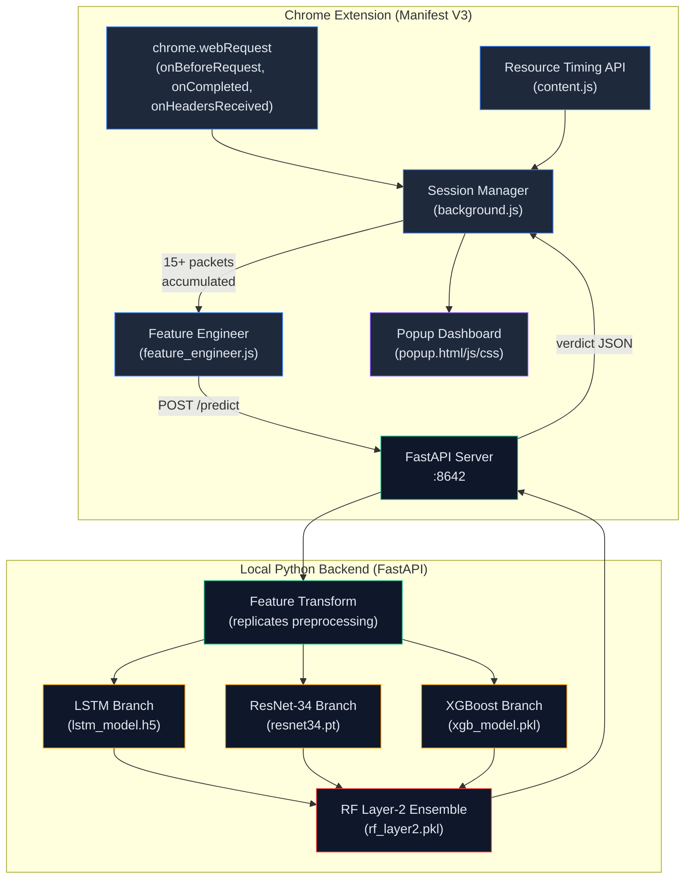

# Implementation Plan — Chrome Extension + Local Backend
## Encrypted Malicious Traffic Detection

---

## Architecture



---

## Directory Structure

```
d:\Feature-Mining-for-Encrypted-Malicious-Traffic-Detection\
├── extension/                          # Chrome Extension
│   ├── manifest.json                   # Manifest V3 config
│   ├── background.js                   # Service worker: webRequest + session mgmt
│   ├── content.js                      # Resource Timing API collector
│   ├── popup/
│   │   ├── popup.html                  # Dashboard layout
│   │   ├── popup.css                   # Glassmorphism dark-mode styling
│   │   └── popup.js                    # Render verdicts, history, settings
│   ├── utils/
│   │   ├── session_manager.js          # Session grouping + flush logic
│   │   └── feature_engineer.js         # Packet list → feature vector JSON
│   └── icons/
│       ├── icon16.png
│       ├── icon48.png
│       └── icon128.png
│
├── backend/                            # Local Python inference server
│   ├── app.py                          # FastAPI entrypoint
│   ├── inference.py                    # EnsemblePredictor class
│   ├── feature_transform.py            # Browser data → model tensors
│   ├── requirements.txt                # fastapi, uvicorn, tensorflow, torch, etc.
│   └── start_backend.bat              # One-click launcher (Windows)
│
├── models/                             # Already exists — trained models
│   ├── lstm_model.h5
│   ├── resnet34.pt
│   ├── xgb_model.pkl
│   └── rf_layer2.pkl
│
└── scalers/                            # Already exists — fitted scalers
    ├── scaler_lstm.pkl
    ├── scaler_resnet_mms.pkl
    └── selector_resnet.pkl
```

---

## Phase 1 — Backend Inference Server

> **Goal:** Python server that loads all 4 models, accepts a session payload, and returns a verdict.

### Task 1.1 — `backend/requirements.txt`

```
fastapi
uvicorn[standard]
tensorflow
torch
torchvision
xgboost
scikit-learn
joblib
numpy
pydantic
```

### Task 1.2 — `backend/feature_transform.py`

Replicates the exact preprocessing from the training pipeline. Must handle the fact that browser-collected data has **different raw fields** than the CSV datasets.

**Inputs:** A JSON session object from the extension:
```json
{
  "session_id": "123:example.com",
  "domain": "example.com",
  "packets": [
    {
      "timestamp": 1720300000000,
      "duration": 45.2,
      "requestSize": 512,
      "responseSize": 15360,
      "transferSize": 15872,
      "encodedBodySize": 15200,
      "decodedBodySize": 48000,
      "headerSize": 672,
      "protocol": "h2",
      "statusCode": 200
    }
  ]
}
```

**Outputs:** Three numpy arrays ready for each model branch.

| Output | Shape | Derivation |
|---|---|---|
| `X_lstm` | `(1, 15, 93)` | Per-packet time features, 15-packet window, mean-padded, scaled with `scaler_lstm.pkl` |
| `X_resnet` | `(1, 1, 38, 38)` | 38 session-level payload stats → outer product, scaled with `scaler_resnet_mms.pkl` |
| `X_xgb` | `(1, 104)` | Session-level ratio + encoded time columns, NaN-filled with training medians |

> [!NOTE]
> **Corrected from the original plan.** The shapes above were verified directly against the trained artifacts (`lstm_model.h5.input_shape`, `xgb_model.pkl.n_features_in_`), not just derived from reading the preprocessing source. The original draft of this plan said `(1, 15, 85)` for LSTM — that was wrong; the real model expects **93** features per packet (7 packet-level + 86 session-level time stats, not 78). `104` for XGBoost was already correct.

**Feature mapping detail:**

```python
class FeatureTransformer:
    """
    Maps browser-collected packet data to model input tensors.

    LSTM (85 features per packet):
      - 7 packet-level time features (from packet timestamps/durations)
      - 78 session-level time stats (mean/median/max/min/std/var of various groups)
      These replicate ALL_TIME_COLS from feature_columns.py

    ResNet (38 payload features):
      - Derived from session-level packet-size statistics
      - Selected by selector_resnet.pkl from PAYLOAD_CANDIDATES
      - Outer product → (38, 38) grayscale image

    XGBoost (104 features):
      - RATIO_COLS + ENC_TIME_SESS_COLS
      - All session-level aggregates
    """

    def __init__(self, scalers_dir, tensors_dir):
        self.scaler_lstm = joblib.load(f'{scalers_dir}/scaler_lstm.pkl')
        self.scaler_resnet = joblib.load(f'{scalers_dir}/scaler_resnet_mms.pkl')
        self.selector_resnet = joblib.load(f'{scalers_dir}/selector_resnet.pkl')
        self.xgb_medians = np.load(f'{tensors_dir}/xgb_col_medians.npy')

    def transform(self, session_data: dict) -> tuple:
        packets = session_data['packets']

        # --- Packet-level features ---
        pkt_features = self._extract_packet_features(packets)

        # --- Session-level stats ---
        sess_stats = self._compute_session_stats(pkt_features)

        # --- LSTM ---
        X_lstm = self._build_lstm_input(pkt_features, sess_stats)

        # --- ResNet ---
        X_resnet = self._build_resnet_input(sess_stats)

        # --- XGBoost ---
        X_xgb = self._build_xgb_input(sess_stats)

        return X_lstm, X_resnet, X_xgb
```

> [!IMPORTANT]
> **Unavailable TCP/IP features** (TTL, TCP window size, IP/TCP header lengths) must be filled with training-set medians or constants (e.g., IP header = 20 bytes). These are loaded from `xgb_col_medians.npy`.

### Task 1.3 — `backend/inference.py`

```python
class EnsemblePredictor:
    def __init__(self, model_dir, scalers_dir, tensors_dir):
        # Load all models once at startup
        self.lstm = tf.keras.models.load_model(f'{model_dir}/lstm_model.h5')
        self.xgb = joblib.load(f'{model_dir}/xgb_model.pkl')
        self.rf = joblib.load(f'{model_dir}/rf_layer2.pkl')
        self.resnet = self._load_resnet(f'{model_dir}/resnet34.pt')
        self.transformer = FeatureTransformer(scalers_dir, tensors_dir)

    def predict(self, session_data: dict) -> dict:
        X_lstm, X_resnet, X_xgb = self.transformer.transform(session_data)

        # Branch predictions (each returns [prob_benign, prob_malicious])
        p_lstm   = self.lstm.predict(X_lstm, verbose=0)[0]
        p_resnet = self._resnet_predict(X_resnet)
        p_xgb    = self.xgb.predict_proba(X_xgb)[0]

        # Layer-2 ensemble
        meta = np.hstack([p_lstm, p_resnet, p_xgb]).reshape(1, -1)  # (1, 6)
        p_final = self.rf.predict_proba(meta)[0]

        return {
            "verdict": "malicious" if p_final[1] > 0.5 else "benign",
            "confidence": float(max(p_final)),
            "malicious_prob": float(p_final[1]),
            "branches": {
                "lstm":    float(p_lstm[1]),
                "resnet":  float(p_resnet[1]),
                "xgboost": float(p_xgb[1])
            }
        }
```

### Task 1.4 — `backend/app.py`

```python
from fastapi import FastAPI
from fastapi.middleware.cors import CORSMiddleware

app = FastAPI(title="Traffic Guardian Backend")
app.add_middleware(CORSMiddleware, allow_origins=["*"],
                   allow_methods=["*"], allow_headers=["*"])

predictor = None  # Lazy init

@app.on_event("startup")
def load_models():
    global predictor
    predictor = EnsemblePredictor(
        model_dir='../models', scalers_dir='../scalers', tensors_dir='../tensors')

@app.post("/predict")
async def predict(payload: dict):
    return predictor.predict(payload)

@app.get("/health")
async def health():
    return {"status": "ok", "models_loaded": predictor is not None}
```

### Task 1.5 — `backend/start_backend.bat`

```batch
@echo off
echo Starting Traffic Guardian Backend...
cd /d "%~dp0"
python -m uvicorn app:app --host 127.0.0.1 --port 8642 --reload
pause
```

---

## Phase 2 — Extension: Network Data Collection

> **Goal:** Capture per-request timing and size metadata, group into sessions.

### Task 2.1 — `extension/manifest.json`

- Manifest V3, service worker background
- Permissions: `webRequest`, `tabs`, `storage`, `notifications`, `alarms`
- Host permissions: `<all_urls>`
- Content script injected on all pages for Resource Timing API

### Task 2.2 — `extension/content.js`

Collects detailed timing from the **Resource Timing API** (not available in service workers):

```javascript
// Periodically harvest resource timing entries and send to background
function harvestTimings() {
  const entries = performance.getEntriesByType('resource');
  if (entries.length === 0) return;

  const data = entries.map(e => ({
    name: e.name,
    duration: e.duration,                    // → Time_cost
    startTime: e.startTime,
    requestStart: e.requestStart,
    responseStart: e.responseStart,
    responseEnd: e.responseEnd,
    transferSize: e.transferSize,            // → IP packet length proxy
    encodedBodySize: e.encodedBodySize,      // → TCP payload proxy
    decodedBodySize: e.decodedBodySize,
    protocol: e.nextHopProtocol,             // h2, h3, http/1.1
  }));

  chrome.runtime.sendMessage({ type: 'RESOURCE_TIMINGS', data });
  performance.clearResourceTimings();
}

setInterval(harvestTimings, 2000);
```

### Task 2.3 — `extension/utils/session_manager.js`

```javascript
// Groups requests by (tabId, domain) into sessions
// Flushes to backend when:
//   - Session has ≥ 15 packets (matches LSTM window), OR
//   - Session has been idle > 30 seconds
export class SessionManager {
  constructor(flushCallback) {
    this.sessions = new Map();          // key → { domain, packets[], lastActivity }
    this.flushCallback = flushCallback;
    this.IDLE_TIMEOUT = 30000;
    this.MIN_PACKETS = 15;

    // Periodic idle check
    setInterval(() => this._checkIdle(), 10000);
  }

  addPacket(tabId, domain, packetData) { /* ... */ }
  _shouldFlush(session) { return session.packets.length >= this.MIN_PACKETS; }
  _checkIdle() { /* flush sessions idle > 30s with ≥ 5 packets */ }
  async flush(sessionKey) { /* POST to backend, handle response */ }
}
```

### Task 2.4 — `extension/background.js`

The service worker wires everything together:

```javascript
import { SessionManager } from './utils/session_manager.js';

const BACKEND = 'http://127.0.0.1:8642';
const manager = new SessionManager(handleVerdict);

// 1. Listen to completed requests for IP, status, headers
chrome.webRequest.onCompleted.addListener((details) => {
  const domain = new URL(details.url).hostname;
  manager.addPacket(details.tabId, domain, {
    timestamp: details.timeStamp,
    ip: details.ip,
    statusCode: details.statusCode,
    responseSize: getContentLength(details.responseHeaders),
    type: details.type,
  });
}, { urls: ['<all_urls>'] }, ['responseHeaders']);

// 2. Receive Resource Timing data from content script
chrome.runtime.onMessage.addListener((msg, sender) => {
  if (msg.type === 'RESOURCE_TIMINGS' && sender.tab) {
    for (const entry of msg.data) {
      const domain = new URL(entry.name).hostname;
      manager.enrichPacket(sender.tab.id, domain, entry);
    }
  }
});

// 3. Handle verdict from backend
function handleVerdict(sessionKey, domain, result) {
  updateBadge(result);
  storeToHistory(domain, result);
  if (result.verdict === 'malicious') showNotification(domain, result);
}
```

---

## Phase 3 — Extension: Popup UI

> **Goal:** Dark-mode glassmorphism dashboard showing real-time status.

### Task 3.1 — `extension/popup/popup.html`

Layout sections:
1. **Header** — "Traffic Guardian" branding + connection status dot (green/red)
2. **Shield Status** — Large animated shield icon (green = safe, red = threat)
3. **Active Domains** — Scrollable list of currently monitored domains with verdict pills
4. **Threat Detail Card** — Expandable: shows branch-level confidence (LSTM / ResNet / XGBoost bars)
5. **History Tab** — Last 50 verdicts in a timeline
6. **Settings Tab** — Backend URL, sensitivity slider, notifications toggle

### Task 3.2 — `extension/popup/popup.css`

Design system:
```css
:root {
  --bg-primary: #0a0e1a;
  --bg-card: rgba(15, 23, 42, 0.8);
  --bg-glass: rgba(30, 41, 59, 0.6);
  --border-glass: rgba(71, 85, 105, 0.3);
  --accent-safe: #10b981;
  --accent-danger: #ef4444;
  --accent-warn: #f59e0b;
  --accent-info: #3b82f6;
  --text-primary: #e2e8f0;
  --text-secondary: #94a3b8;
  --font: 'Inter', system-ui, sans-serif;
}
```

Key visual elements:
- Glassmorphism cards with `backdrop-filter: blur(12px)`
- Confidence bars with gradient fills and smooth transitions
- Pulse animation on shield when threat detected
- Smooth slide-in for threat notifications
- Radial confidence meter using conic-gradient

### Task 3.3 — `extension/popup/popup.js`

```javascript
// On popup open:
// 1. Check backend health → update connection indicator
// 2. Load threat history from chrome.storage.local
// 3. Render active sessions + their verdicts
// 4. Set up live update listener

document.addEventListener('DOMContentLoaded', async () => {
  await checkBackendHealth();
  await renderHistory();
  await renderActiveSessions();
  setupLiveUpdates();
});
```

---

## Phase 4 — Feature Engineering Bridge (JS → Python)

> **Goal:** Map browser-observable metrics to the exact feature vectors each model expects.

### Task 4.1 — `extension/utils/feature_engineer.js`

Computes as much as possible on the client side before sending to backend:

```javascript
export function buildSessionPayload(session) {
  const packets = session.packets.map(p => ({
    // Timing (→ LSTM time features)
    timestamp:   p.timestamp,
    duration:    p.duration || 0,            // Time_cost
    // Sizes (→ ResNet payload features, XGBoost)
    requestSize:     p.requestSize || 0,
    responseSize:    p.responseSize || 0,
    transferSize:    p.transferSize || 0,
    encodedBodySize: p.encodedBodySize || 0,
    decodedBodySize: p.decodedBodySize || 0,
    headerSize:      (p.transferSize || 0) - (p.encodedBodySize || 0),
    // Meta
    protocol:   p.protocol || 'unknown',
    statusCode: p.statusCode || 0,
  }));

  return {
    session_id: session.key,
    domain: session.domain,
    packet_count: packets.length,
    packets: packets,
  };
}
```

### Task 4.2 — `backend/feature_transform.py` (detailed mapping)

This is the **most critical file** — it bridges browser data to model expectations.

#### LSTM Branch: 93 features × 15 packets

```
Packet-level (7 per packet):
  [0] Time_cost                     → packet.duration
  [1] Time_diff_between_packets     → packet[i].timestamp - packet[i-1].timestamp
  [2] IAT_forward                   → delta between consecutive request starts
  [3] IAT_backward                  → delta between consecutive response ends
  [4] IAT_forward_enc               → log1p(IAT_forward)
  [5] IAT_backward_enc              → log1p(IAT_backward)
  [6] ratio_to_previous_enc         → duration[i] / duration[i-1]

Session-level (86, broadcast to every packet row):
  35 raw time/TTL stats + 29 encoded (log1p) stats + 22 raw/enc ratio stats
  (mirrors SESS_TIME_COLS in feature_columns.py exactly)
  Computed once per session, same value in every row
```

#### ResNet Branch: 38 selected from 48 payload candidates

```
Session-level stats of packet sizes:
  - Length_of_IP_packets       → transferSize
  - Length_of_TCP_payload      → encodedBodySize
  - Length_of_TCP_packet_header → transferSize - encodedBodySize
  - Length_of_IP_packet_header → constant 20
  - TCP_windows_size_value     → training median (not observable)
  - Length_of_TCP_segment      → transferSize
  - forward_packet_length      → requestSize
  - backward_packet_length     → responseSize

Each group: mean, median, max, min, std, var → 8 groups × 6 stats = 48 candidates
selector_resnet.pkl picks 38 → outer product → (1, 38, 38)
```

#### XGBoost Branch: 104 features

```
RATIO_COLS (72 cols, verified against the real column order in
  Train Set/session_based_trainset.csv): raw_value / log1p(raw_value) ratios
  → Computed where a browser-observable proxy exists (packet-length,
    flow duration, IAT, IP header, payload totals — ~52 of 72 columns)
  → Left at the training median where nothing observable maps to it
    (TCP window size, TTL, per-direction TCP header/segment splits — 20 cols)

ENC_TIME_SESS_COLS (32 cols): encoded session time statistics
  → Computed from packet timing, same as LSTM session-level stats
```

Every one of the 104 slots is positioned to match the exact order the model
was trained on (`backend/feature_transform.py::_build_xgb`) — since
XGBoost/RF split on feature *position*, not name, getting the order right
matters as much as getting the count right. See the docstring in
`_build_xgb` for the full index-by-index mapping.

> [!WARNING]
> This is inherently an approximation: TCP window size, TTL, and per-direction
> header/segment sizes are not observable from a browser extension at all
> (no raw packet access). Those ~20 columns fall back to training medians.
> If real accuracy needs validation, compare `EnsemblePredictor.predict()`
> output against `tensors/X_xgb_test.npy` rows for known-label sessions.

---

## Phase 5 — Polish & Packaging

### Task 5.1 — One-Click Launcher

`backend/start_backend.bat` — double-click to start the server on Windows.

### Task 5.2 — Backend Health Indicator

Extension checks `GET /health` every 30 seconds:
- **Green dot** in popup header → backend connected
- **Red dot** + "Backend Offline" banner → shows instructions to start

### Task 5.3 — Settings Panel

Stored in `chrome.storage.local`:
```json
{
  "backendUrl": "http://127.0.0.1:8642",
  "sensitivityThreshold": 0.5,
  "notificationsEnabled": true,
  "autoAnalyze": true,
  "minPacketsForAnalysis": 15
}
```

### Task 5.4 — Export & History

- **Threat log** — stored in `chrome.storage.local`, capped at 200 entries
- **Export as CSV** — button in popup downloads threat history
- **Clear history** — button with confirmation dialog

### Task 5.5 — Error Handling

| Scenario | Handling |
|---|---|
| Backend not running | Show "offline" state, queue sessions, retry on reconnect |
| Backend returns error | Log to console, don't show false alert |
| No packets captured | Show "monitoring..." state with subtle pulse animation |
| Extension updated | Migrate `chrome.storage` schema if needed |

### Task 5.6 — Icons

Generate 3 icon sizes (16, 48, 128px) — shield-shaped with gradient, representing security/protection.

---

## Execution Order

```mermaid
gantt
    title Build Sequence
    dateFormat  X
    axisFormat %s

    section Phase 1: Backend
    requirements.txt           :p1a, 0, 1
    feature_transform.py       :p1b, 1, 3
    inference.py               :p1c, 3, 5
    app.py + start_backend.bat :p1d, 5, 6

    section Phase 2: Extension Core
    manifest.json              :p2a, 6, 7
    content.js                 :p2b, 7, 8
    session_manager.js         :p2c, 7, 9
    background.js              :p2d, 9, 11

    section Phase 3: Extension UI
    popup.html + popup.css     :p3a, 11, 14
    popup.js                   :p3b, 14, 16

    section Phase 4: Feature Bridge
    feature_engineer.js        :p4a, 6, 8
    feature_transform.py tests :p4b, 16, 18

    section Phase 5: Polish
    Icons + launcher           :p5a, 18, 19
    Settings + export          :p5b, 19, 20
    Error handling + testing   :p5c, 20, 22
```



---

## File Checklist

| # | File | Phase | Status |
|---|---|---|---|
| 1 | `backend/requirements.txt` | 1 | ✅ |
| 2 | `backend/feature_transform.py` | 1 | ✅ |
| 3 | `backend/inference.py` | 1 | ✅ |
| 4 | `backend/app.py` | 1 | ✅ |
| 5 | `backend/start_backend.bat` | 1 | ✅ |
| 6 | `extension/manifest.json` | 2 | ✅ |
| 7 | `extension/content.js` | 2 | ✅ |
| 8 | `extension/utils/session_manager.js` | 2 | ✅ |
| 9 | `extension/utils/feature_engineer.js` | 2+4 | ✅ |
| 10 | `extension/background.js` | 2 | ✅ |
| 11 | `extension/popup/popup.html` | 3 | ✅ |
| 12 | `extension/popup/popup.css` | 3 | ✅ |
| 13 | `extension/popup/popup.js` | 3 | ✅ |
| 14 | `extension/icons/*` | 5 | ✅ |

All Phase 1-5 files exist and are wired together. Items still open from the
optimization backlog (Phase 2 of `pipeline_spec.md`): real outbound request
sizes, JA3/JA4 fingerprinting, async backend worker, sliding-window
classification — these are future-work, not blockers.

---

## Implementation Notes / Deviations From This Plan

1. **LSTM input is `(1, 15, 93)`, not `(1, 15, 85)`.** This plan originally
   guessed 85 (7 packet-level + a miscounted 78 session-level stats). The
   real trained model — verified via `lstm_model.h5`'s `input_shape` — takes
   93 (7 + 86). The implementation was already dimensionally correct; only
   this document's numbers were wrong.
2. **XGBoost's 104-feature vector is now built in exact trained column
   order**, not just padded/trimmed to the right count. See the XGBoost
   Branch section above and the `_build_xgb` docstring in
   `backend/feature_transform.py`.
3. **`backend/app.py` resolves `PROJECT_ROOT` from `__file__`**, not a
   hardcoded `D:\...` path, so the backend runs after cloning to any
   machine/path.
4. **CORS uses `allow_credentials=False`** — the extension doesn't send
   cookies/auth headers, and pairing a wildcard origin with credentials is
   an invalid CORS configuration anyway.
5. **Fixed a critical timestamp-precision bug found during end-to-end
   testing.** `FeatureTransformer.transform()` cast raw millisecond-epoch
   timestamps (`Date.now()`-scale, ~1.7e12) straight to `float32`. Float32
   only carries ~7 significant digits, so at that magnitude it cannot
   represent anything finer than ~131 seconds — every sub-second
   inter-packet gap silently rounded to zero. That zeroed out IAT, flow
   duration, and most of the LSTM's session-level time stats for essentially
   *every real session* the extension would ever send (real durations are
   milliseconds-to-seconds, not minutes). Verified via a smoke test:
   before the fix, three sessions with drastically different packet timing
   produced bit-identical LSTM predictions; after rebasing timestamps to
   "ms since first packet" in float64 before downcasting, predictions
   correctly diverge. This was the single highest-impact fix in this pass —
   worse than the XGBoost column-ordering issue, since it silently degraded
   the LSTM branch on every request, not just some feature slots.
