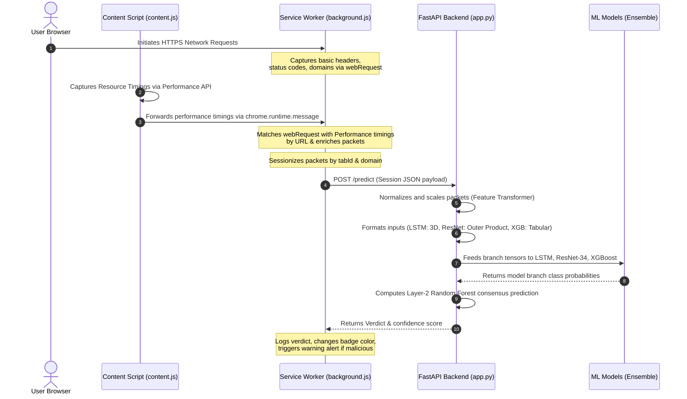

# Traffic Guardian - Detailed Pipeline & Optimization Plan

This document details the step-by-step lifecycle of network traffic in the Traffic Guardian system, covering capture, monitoring, backend transmission, preprocessing, and model prediction. It also includes an optimization plan to improve capture accuracy and system performance.

---

## 1. Step-by-Step Traffic Lifecycle

---

## 2. Technical Implementation Details

### A. Packet Capture & Enrichment (Extension)
1.  **Network Request Interception:**
    *   The extension listens to `chrome.webRequest.onCompleted` events to capture outbound request parameters.
    *   This API provides basic details: `timestamp`, target `url`, server `ip`, request `type`, and response `statusCode`.
    *   It extracts the `Content-Length` header from `responseHeaders` to calculate response sizes.
2.  **Resource Timings Harvesting (Content Script):**
    *   Because `chrome.webRequest` lacks high-resolution timings (e.g., duration, transfer sizes, header sizes), `content.js` runs in the document context.
    *   It polls `performance.getEntriesByType('resource')` and sends the serialized timing entries to the background page.
3.  **Timing Alignment & Packet Enrichment:**
    *   The `SessionManager` matches timing logs against corresponding request packets using URL keys.
    *   It populates: `duration`, `transferSize`, `encodedBodySize`, `decodedBodySize`, and calculates `headerSize = Math.max(0, transferSize - encodedBodySize)`.

### B. Sessionization & Backend Communication
*   **Aggregation:** Packets are grouped into sessions using a composite key: `tabId` + `domain`.
*   **Flush Conditions:**
    *   *Volume-based:* Once a session accumulates `15` packets, the extension flushes it immediately.
    *   *Time-based:* If a session has at least `3` packets but remains idle for `30` seconds, the idle check timer deletes and flushes the session.
*   **Transmission:** The payload is sent as a JSON POST request to the backend `/predict` endpoint.

### C. Preprocessing & Tensor Scaling (FastAPI Backend)
*   **Statistical Analysis:** The `FeatureTransformer` converts packet arrays into time deltas (Inter-Arrival Time, or IAT) and calculates statistics (mean, median, max, min, std, variance) at the session level.
*   **Multi-Branch Formatting:**
    *   **LSTM:** Tensors are trimmed or padded to exactly `15` packets. The system applies a 3D Standard Scaler, generating a `(1, 15, 93)` input tensor (7 packet-level + 86 session-level time stats — verified against the trained model's `input_shape`, correcting an earlier draft that said 85).
    *   **ResNet-34:** Group size metrics are compiled into 48 features, reduced to 38 features via SelectKBest, scaled via MinMaxScaler, and multiplied by their transpose (outer product) to create a 2D image matrix of `(1, 1, 38, 38)`.
    *   **XGBoost:** Features are arranged into a tabular vector of size `104`, in the exact column order the model was trained on (72 `_ratio` columns + 32 `ENC_TIME_SESS_COLS`). Roughly 52 of the 72 ratio columns have a genuine browser-observable proxy (packet-length, flow duration, IAT, IP header, payload totals); the remaining ~20 — TCP window size, TTL, and per-direction header/segment splits, none of which a browser extension can see — are imputed with training medians rather than left at zero/NaN.

### D. Prediction & Decision Logic
1.  **Parallel Execution:** The processed tensors are passed into the respective model branches: LSTM (TensorFlow), ResNet-34 (PyTorch), and XGBoost (scikit-learn).
2.  **Meta-Classification:** The predictions from all three models are concatenated into a `(1, 6)` array and evaluated by the Layer-2 Random Forest Meta-Classifier (`rf_layer2.pkl`).
3.  **Verdict Output:** If the meta-classifier's malicious probability score exceeds `0.5`, the verdict is flagged as `malicious`.

---

## 3. Optimization & Improvement Plan

Below is an optimization plan addressing current system constraints and features not yet implemented:

### 1. Capturing Real Outbound Request Sizes
*   **Current Constraint:** Request payload size is currently hardcoded as `0` because `chrome.webRequest` cannot read request body streams without performance degradation.
*   **Optimization:** Implement the `chrome.declarativeNetRequest` API or intercept the `Fetch`/`XHR` APIs inside the content script using a lightweight monkey-patch wrapper. This allows the extension to measure outbound POST/PUT request bodies before transmission.

### 2. JA3/JA4 TLS Fingerprinting
*   **Current Constraint:** Encrypted traffic classification is highly dependent on SSL/TLS negotiation details, but Chrome extensions cannot intercept raw TCP/TLS handshakes.
*   **Optimization:** Integrate a local Python-based network helper using `scapy` or `WinDivert` on the host machine. When the browser initiates a connection, the helper extracts the JA3/JA4 handshake client-hello signatures, matches them with the browser destination ports, and appends them to the session metadata.

### 3. Non-blocking Asynchronous Backend Worker
*   **Current Constraint:** FastAPI runs model predictions synchronously on the main thread pool. Under high network traffic, large classification requests will block the event loop.
*   **Optimization:** Wrap the inference and prediction routines in an asynchronous executor using `asyncio.to_thread` or run them inside a dedicated Process Pool Executor (`concurrent.futures.ProcessPoolExecutor`) to offload CPU-bound ML computations from the REST thread.

### 4. Dynamic Window Size & Sliding Classification
*   **Current Constraint:** The system waits for a static batch of 15 packets to evaluate, which can delay classifications on slow page loads.
*   **Optimization:** Implement a sliding window classification strategy. The extension can flush updates to the backend every `5` packets, keeping a rolling window state on the server. If the malicious probability exceeds the threshold at any point, the threat is blocked immediately.
